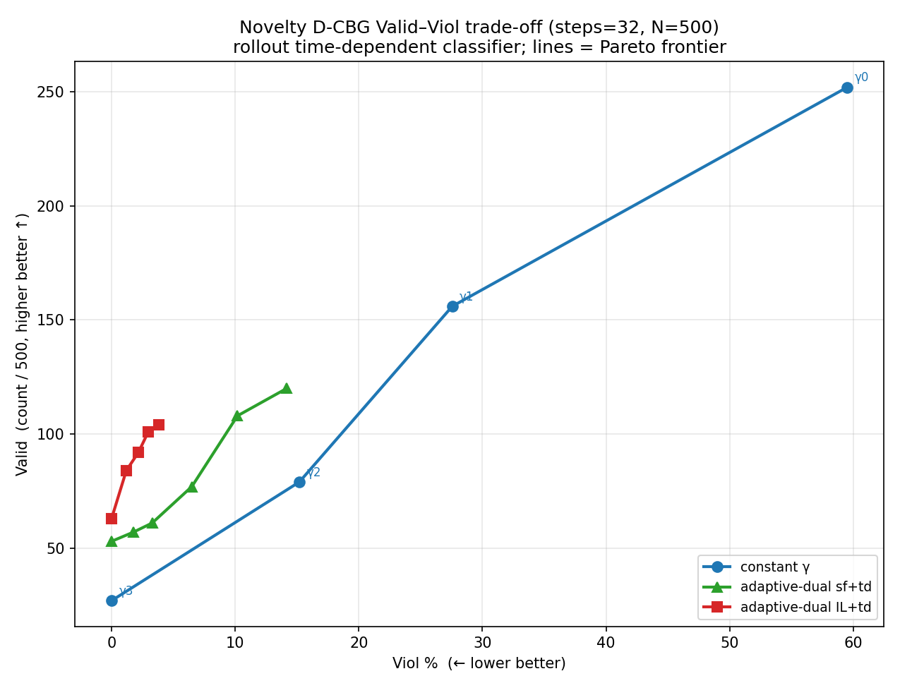
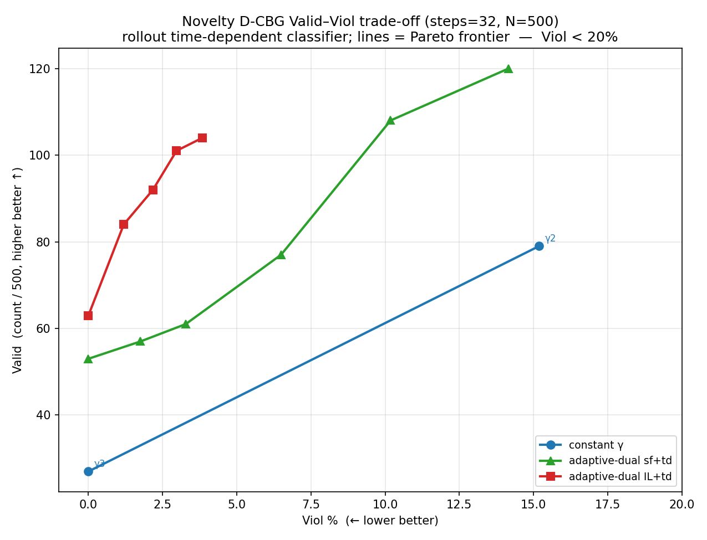
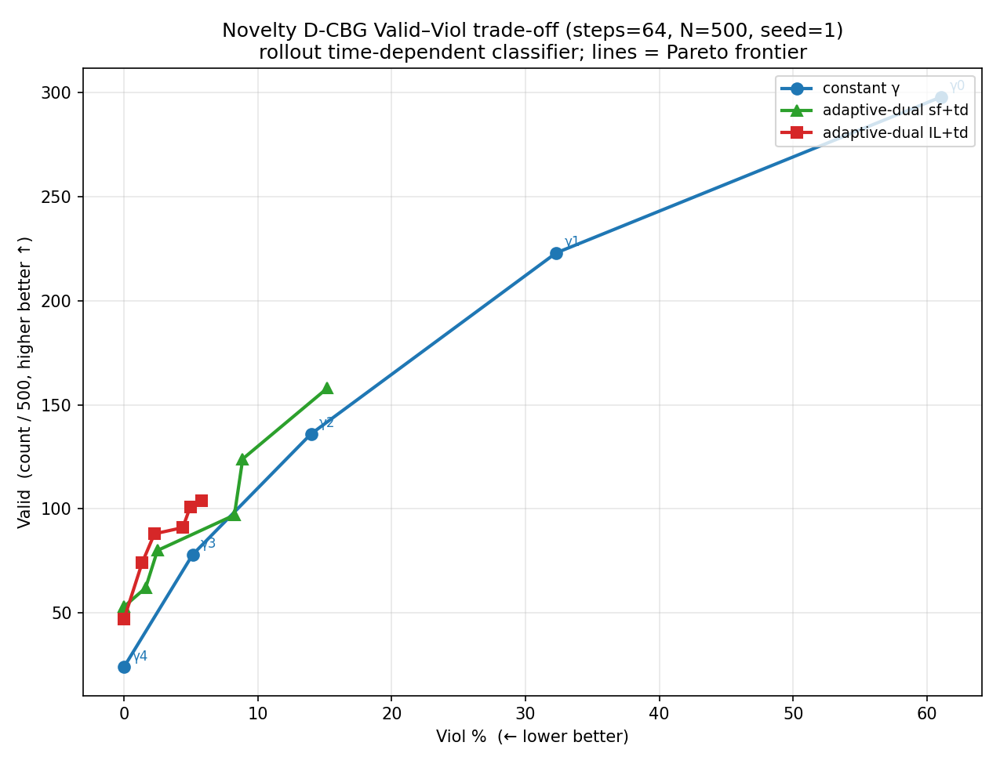
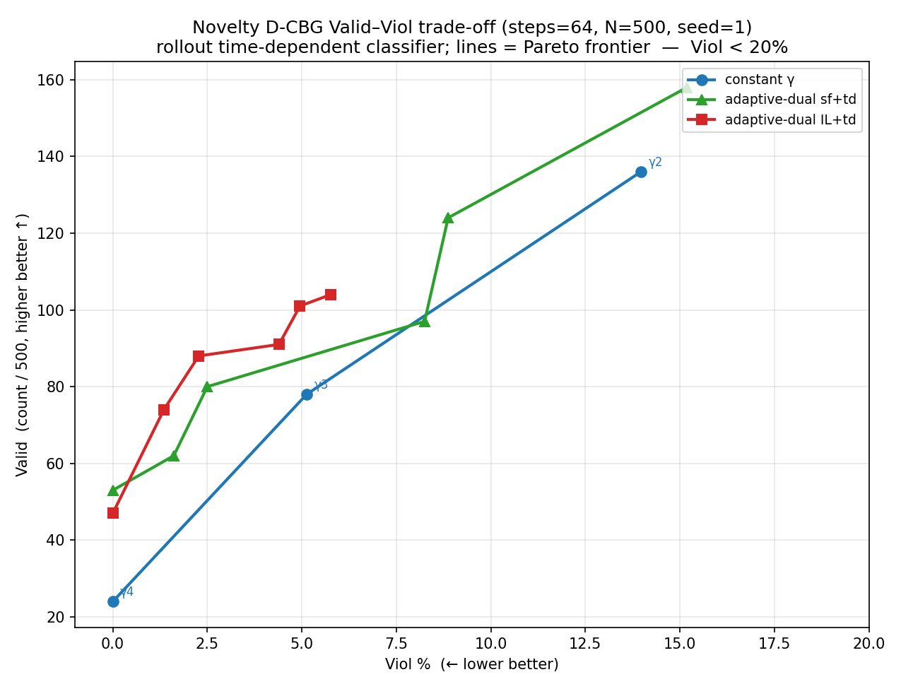
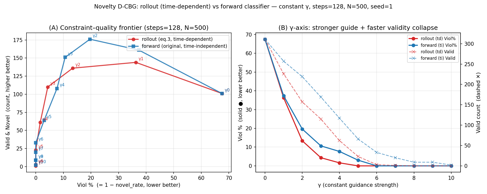

# Novelty-Constrained Eval — CBG constant-γ vs Adaptive-Dual (sample_first / inner-loop) + Time-Dependent (rollout) Classifier

**Setup:** QM9 SMILES, MDLM (absorbing-state, subs, T=0, length=32), seed=1 unless noted, N=500.
Constraint: novel = canonical SMILES ∉ QM9-train. `Viol %` = 1 − novel_rate.
Classifier ckpt: `outputs/qm9/classifier/novelty_rollout_timedep/checkpoints/best.ckpt`
(`guidance.classifier_time_conditioning=True`). Dual update (sample_first):
`λ ← clip((λ − ρ·(log p(novel|x_t)+C))₊, 0, λmax)`; C = −log(target p(novel)).

---

## steps = 32 (N=500, seed=1)

**Constant γ — rollout/td:**

<!-- AUTO: python experiments/molecule_novelty/analysis/summarize_rollout.py _steps32 -->

| Method | Valid | Unique | Viol % | **Valid & Novel** | QED | Time (s) |
| :----- | ----: | -----: | -----: | ----------------: | --: | -------: |
| γ = 0 (no-guidance) | 252 | 240 | 59.52% | 102 | 0.459 | 48 |
| CBG γ = 1 | 156 | 156 | 27.56% | 113 | 0.458 | 331 |
| CBG γ = 2 |  79 |  79 | 15.19% | 67 | 0.464 | 329 |
| **CBG γ = 3** |  27 |  27 | **0.00%** ⭐ | 27 | 0.472 | 327 |
| CBG γ = 4 |   3 |   3 | 0.00% | 3 | 0.343 | 329 |
| CBG γ = 5 |   3 |   3 | 0.00% | 3 | 0.500 | 317 |
| CBG γ = 6 |   0 |   0 | — | 0 | — | 301 |
| CBG γ = 7 |   0 |   0 | — | 0 | — | 283 |

Reproduce: `CUDA_VISIBLE_DEVICES=2 bash scripts/sweep_gamma_rollout.sh "0 1 2 3" 32` · `CUDA_VISIBLE_DEVICES=3 bash scripts/sweep_gamma_rollout.sh "4 5 6 7" 32` (CSVs `results/{noguidance,dcbg_gamma{1..7}}_rollout_steps32_results.csv`).

**Adaptive-dual sample_first (Algm 1) + rollout/td** (combo `C:ρ:λ₀:λmax:seed:steps`):

| Method | Valid | Unique | Viol % | **Valid & Novel** | QED | Time (s) |
| :----- | ----: | -----: | -----: | ----------------: | --: | -------: |
| **adual sf+td C=−log0.995 ρ0.3 λ₀2.65 λmax8 (seed4)** | 53 | 53 | **0.00%** ⭐ | 53 | 0.496 | 488 |
| adual sf+td C=−log0.995 ρ0.3 λ₀2.75 λmax8 (seed1) | 42 | 42 | 0.00% | 42 | 0.461 | 344 |
| adual sf+td C=−log0.995 ρ0.3 λ₀2.65 λmax8 (seed1) | 41 | 41 | 0.00% | 41 | 0.463 | 347 |
| adual sf+td C=−log0.995 ρ0.3 λ₀2.6 λmax8 (seed4) | 57 | 57 | 1.75% | 56 | 0.493 | 361 |
| adual sf+td C=−log0.995 ρ0.3 λ₀2.55 λmax8 (seed1) | 50 | 50 | 4.00% | 48 | 0.465 | 347 |

Reproduce (goal Viol=0 & Valid>45 point): `CUDA_VISIBLE_DEVICES=2 bash scripts/search_adual_sftd.sh "0.0050125:0.3:2.65:8.0:4:32"` (master `results/adual_sftd_search_steps32.csv`; traj `results/adual_sftd_search/adual_sftd_C0.0050125_rho0.3_l02.65_lmax8.0_seed4_steps32_traj.json`).

**Adaptive-dual inner-loop (Algm 2, IL) + rollout/td** (combo `C:ρ:λ₀:λmax:J:n:seed`; Pareto frontier, all seed=4):

| Method | Valid | Unique | Viol % | **Valid & Novel** | QED | Time (s) |
| :----- | ----: | -----: | -----: | ----------------: | --: | -------: |
| **adual IL+td C=−log0.999 ρ1.4 λ₀1.85 λmax20 J2 n4 (seed4)** | 63 | 63 | **0.00%** ⭐ | 63 | 0.481 | 475 |
| adual IL+td C=−log0.999 ρ1.5 λ₀1.8 λmax20 J2 n4 (seed4) | 58 | 58 | 0.00% | 58 | 0.475 | 635 |
| adual IL+td C=−log0.99 ρ0.8 λ₀2.0 λmax12 J2 n4 (seed4) | 75 | 75 | 1.33% | 74 | 0.473 | 631 |
| adual IL+td C=−log0.999 ρ0.8 λ₀2.1 λmax12 J2 n4 (seed4) | 71 | 71 | 1.41% | 70 | 0.481 | 632 |
| adual IL+td C=−log0.99 ρ0.8 λ₀2.15 λmax12 J2 n4 (seed4) | 68 | 68 | 1.47% | 67 | 0.477 | 710 |
| adual IL+td C=−log0.99 ρ0.6 λ₀2.25 λmax12 J2 n4 (seed4) | 66 | 66 | 1.52% | 65 | 0.475 | 704 |

Reproduce (goal Viol=0 & Valid>60 point): `CUDA_VISIBLE_DEVICES=2 bash scripts/search_adual_iltd.sh "0.0010005:1.4:1.85:20.0:2:4:4:32"` (combo `C:ρ:λ₀:λmax:J:n:seed:steps`; master `results/adual_iltd_search_steps32.csv`).

### Figure — Valid–Viol trade-off (constant γ vs adual sf+td vs IL+td, steps=32)

<!-- AUTO: python experiments/molecule_novelty/analysis/plot_valid_viol_steps32.py -->





## steps = 64 (N=500, seed=1)

**Constant γ + adaptive-dual (sf+td / IL+td), rollout/td.** `Eff. QED` = Σ valid QED / 500; IL+td uses n=4 unless noted.

<!-- AUTO: python experiments/molecule_novelty/analysis/summarize_rollout.py _steps64 -->
<!-- AUTO (Eff. QED column): python experiments/molecule_novelty/analysis/compute_effective_qed.py -->

| Method | Valid | Unique | Viol % | **Valid & Novel** | QED | Eff. QED | Time (s) |
| :----- | ----: | -----: | -----: | ----------------: | --: | -------: | -------: |
| γ = 0 (no-guidance) | 298 | 292 | 61.07% | 116 | 0.450 | 0.272 | 73 |
| CBG γ = 1 | 223 | 223 | 32.29% | 151 | 0.461 | 0.205 | 556 |
| CBG γ = 2 | 136 | 136 | 13.97% | 117 | 0.461 | 0.126 | 553 |
| CBG γ = 3 |  78 |  78 | **5.13%** | 74 | 0.472 | 0.074 | 545 |
| CBG γ = 4 |  24 |  24 | 0.00% | 24 | 0.490 | 0.024 | 529 |
| adual sf+td C=−log0.9 ρ0.3 λ₀1 λmax8 | 158 | 158 | 15.19% | 134 | 0.458 | 0.145 | 589 |
| adual sf+td C=−log0.99 ρ0.3 λ₀2 λmax10 | 124 | 124 | 8.87% | 113 | 0.468 | 0.116 | 586 |
| adual sf+td C=−log0.995 ρ1.5 λ₀2 λmax10 | 97 | 97 | 8.25% | 89 | 0.469 | 0.091 | 578 |
| adual sf+td C=−log0.999 ρ0.2 λ₀3.2 λmax6 (seed4) | 80 | 80 | 2.50% | 78 | 0.464 | 0.074 | 577 |
| adual sf+td C=−log0.999 ρ0.2 λ₀3.2 λmax6 (seed1) | 62 | 62 | 1.61% | 61 | 0.479 | 0.060 | 579 |
| **adual sf+td C=−log0.999 ρ0.2 λ₀3.25 λmax6 (seed1)** | 53 | 53 | **0.00%** ⭐ | 53 | 0.481 | 0.051 | 578 |
| adual IL+td J2 ρ0.8 λ₀2 λmax12 | 104 | 104 | 5.77% | 98 | 0.479 | 0.100 | 845 |
| adual IL+td J2 ρ1.0 λ₀2 λmax12 | 101 | 101 | 4.95% | 96 | 0.468 | 0.095 | 838 |
| adual IL+td J4 n2 ρ0.6 λ₀2 λmax12 | 91 | 91 | 4.40% | 87 | 0.467 | 0.085 | 845 |
| adual IL+td J4 ρ0.6 λ₀2 λmax12 (seed1) | 88 | 88 | 2.27% | 86 | 0.490 | 0.086 | 1089 |
| adual IL+td J4 ρ0.6 λ₀2 λmax12 (seed3) | 74 | 74 | 1.35% | 73 | 0.488 | 0.072 | 1102 |
| **adual IL+td J4 ρ0.6 λ₀2.25 λmax12 (seed3)** | 66 | 66 | **0.00%** ⭐ | 66 | 0.490 | 0.065 | 1739 |

Reproduce: `CUDA_VISIBLE_DEVICES=2 bash scripts/search_adual_sftd.sh "0.01005:0.3:2.0:10.0:1"` (master `results/adual_sftd_search_steps64.csv`) · `CUDA_VISIBLE_DEVICES=2 bash scripts/search_adual_iltd.sh "0.0100503:0.6:2.0:12.0:4:4:1"` (combo `C:ρ:λ₀:λmax:J:n:seed`; master `results/adual_iltd_search_steps64.csv`).

### Figure — Valid–Viol trade-off (constant γ vs adual sf+td vs IL+td, steps=64)

<!-- AUTO: python experiments/molecule_novelty/analysis/plot_valid_viol_steps64.py -->





## steps = 128 (N=500, seed=1)

**Summary — rollout (td) vs forward (ti) classifier:**

| Classifier | best-V&N point | Valid | Viol % | **Valid&Novel** | low-Viol point | Valid | Viol % | Valid&Novel |
| :--------- | :------------- | ----: | -----: | --------------: | :------------- | ----: | -----: | ----------: |
| **rollout (td)** | γ=2 | 157 | 13.38% | **136** | γ=3 | 115 | **4.35%** | 110 |
| forward (ti)     | γ=2 | 219 | 19.63% | **176** ⭐ | γ=4 | 117 | 7.69% | 108 |

**Constant γ — rollout (eq.3, time-dependent) classifier:**

<!-- AUTO: python experiments/molecule_novelty/analysis/summarize_rollout.py "" -->

| Method | Valid | Unique | Viol % | **Valid & Novel** | QED | Time (s) |
| :----- | ----: | -----: | -----: | ----------------: | --: | -------: |
| γ = 0 (no-guidance) | 311 | 303 | 67.52% | 101 | 0.458 | 100 |
| CBG γ = 1 | 226 | 226 | 36.28% | 144 | 0.459 | 791 |
| CBG γ = 2 | 157 | 157 | 13.38% | 136 | 0.463 | 796 |
| CBG γ = 3 | 115 | 115 | **4.35%** | 110 | 0.464 | 789 |
| CBG γ = 4 |  62 |  62 | 1.61% | 61 | 0.475 | 771 |
| CBG γ = 5 |  23 |  23 | 0.00% | 23 | 0.500 | 713 |
| CBG γ = 6 |   3 |   3 | 0.00% | 3 | 0.540 | 645 |
| CBG γ = 7 |   1 |   1 | 0.00% | 1 | 0.595 | 565 |
| CBG γ = 8 |   0 |   0 | — | 0 | — | — |
| CBG γ = 9 |   0 |   0 | — | 0 | — | — |
| CBG γ = 10 |  0 |   0 | — | 0 | — | — |

Reproduce: `CUDA_VISIBLE_DEVICES=6 bash scripts/time_gamma_rollout.sh "0 1 2 3" 128` · `CUDA_VISIBLE_DEVICES=7 bash scripts/time_gamma_rollout.sh "4 5 6 7" 128` (per-γ timing → `results/timing/timing_rollout_gpu{6,7}.csv`).

**Adaptive-dual sample_first (Algm 1) + rollout/td** (combo `C:ρ:λ₀:λmax:seed:steps`):

| Method | Valid | Unique | Viol % | **Valid & Novel** | QED | Time (s) |
| :----- | ----: | -----: | -----: | ----------------: | --: | -------: |
| **adual sf+td ρ0.5 λ₀3.85 λmax12 C0.01005 (seed1)** | 74 | 74 | **0.00%** ⭐ | 74 | 0.476 | 828 |
| adual sf+td ρ0.55 λ₀3.82 λmax13 C0.005 (seed7) | 72 | 72 | **0.00%** | 72 | 0.484 | 827 |
| adual sf+td ρ0.4 λ₀4.0 λmax10 C0.01005 (seed1) | 61 | 61 | 0.00% | 61 | 0.472 | 826 |
| adual sf+td ρ0.55 λ₀3.82 λmax13 C0.005 (seed8) | 95 | 95 | 5.26% | 90 | 0.492 | 833 |
| adual sf+td ρ0.55 λ₀3.8 λmax13 C0.005 (seed2) | **87** | 87 | 2.30% | 85 | 0.484 | 835 |
| adual sf+td ρ0.5 λ₀3.85 λmax12 C0.01005 (seed2) | 85 | 85 | 3.53% | 82 | 0.484 | 835 |
| adual sf+td ρ0.6 λ₀3.6 λmax14 C0.005 (seed2) | 84 | 84 | **2.38%** | 82 | 0.477 | 837 |
| adual sf+td ρ0.5 λ₀3.75 λmax12 C0.01005 (seed2) | 82 | 82 | 2.44% | 80 | 0.482 | 833 |
| adual sf+td ρ0.5 λ₀3.75 λmax12 C0.005 (seed1) | 78 | 78 | **1.28%** | 77 | 0.478 | 836 |

Reproduce: `CUDA_VISIBLE_DEVICES=6 bash scripts/search_adual_sftd.sh "0.01005:0.5:3.85:12.0:1:128"` (master `results/adual_sftd_search_steps128.csv`, per-run timing in `seconds` col).

**Adaptive-dual inner-loop (Algm 2, IL) + rollout/td** (combo `C:ρ:λ₀:λmax:J:n:seed:steps`; n=4 unless noted):

| Method | Valid | Unique | Viol % | **Valid & Novel** | QED | Time (s) |
| :----- | ----: | -----: | -----: | ----------------: | --: | -------: |
| **adual IL+td ρ0.8 λ₀2.0 λmax16 J6 C0.01005 (seed1)** | 67 | 67 | **0.00%** ⭐ | 67 | 0.480 | 2337 |
| adual IL+td ρ0.6 λ₀3.0 λmax14 J6 C0.005 (seed1) | 58 | 58 | 0.00% | 58 | 0.486 | 2329 |
| **adual IL+td ρ0.6 λ₀2.0 λmax12 J6 C0.01005 (seed1)** | 87 | 87 | 1.15% | 86 | 0.485 | 2338 |
| adual IL+td ρ0.6 λ₀2.0 λmax12 J6 C0.01005 (seed6) | 85 | 85 | 1.18% | 84 | 0.493 | 2324 |
| adual IL+td ρ0.6 λ₀2.8 λmax12 J5 C0.01005 (seed1) | 84 | 84 | 1.19% | 83 | 0.481 | 2092 |
| adual IL+td ρ0.6 λ₀2.0 λmax12 J6 C0.005 (seed1) | 84 | 84 | 1.19% | 83 | 0.485 | 2341 |
| adual IL+td ρ0.6 λ₀2.5 λmax12 J4 C0.01005 (seed1) | 89 | 89 | 3.37% | 86 | 0.494 | 1919 |
| adual IL+td ρ0.6 λ₀2.0 λmax12 J6 C0.01005 (seed4) | 91 | 91 | 5.50% | 86 | 0.486 | 2342 |
| adual IL+td ρ0.6 λ₀2.0 λmax12 J8 C0.01005 (seed1) | 74 | 74 | 4.05% | 71 | 0.504 | 2832 |
| adual IL+td ρ0.6 λ₀2.0 λmax12 J6 n8 C0.01005 (seed1) | 73 | 73 | 1.37% | 72 | 0.485 | 3767 |

**Viol=0 & Valid>80 not reached at steps=128 (both variants).** IL beats sf+td's wall — its per-step λ* solve keeps λ₀ low (2.0, high Valid) and leaves only **1 violator** at Valid 84–87 (Viol 1.15–1.19%) vs sf+td's 2–3. But that last violator is a hard floor: a 7-seed sweep at λ₀2.0/J6 (seeds 1–7: Valid 63–91, violators 1–5) never hit 0 at Valid>80. Same classifier-false-positive limit. Over-solving backfires (J8→Valid74/Viol4%; n8→Valid73, 2× slower). Only Viol=0 IL point is Valid 58 (< sf+td's 74). **Classifier-error-limited, not optimizer-limited** — the one untried lever is more sampling steps (256/512). Reproduce best near-miss: `CUDA_VISIBLE_DEVICES=6 bash scripts/search_adual_iltd.sh "0.01005:0.6:2.0:12.0:6:4:1:128"` (master `results/adual_iltd_search_steps128.csv`, timing in `seconds` col).

### Figure — rollout vs forward classifier (constant γ, steps=128)



Regenerate: `python experiments/molecule_novelty/analysis/plot_rollout_vs_forward.py`.

## steps = 256 (N=500, seed=1)

**Constant γ — rollout/td:** _pending._
**Adaptive-dual sf+td:** _pending._
**Adaptive-dual IL+td:** _pending._

## steps = 512 (N=500, seed=1)

**Constant γ — rollout/td:** _pending._
**Adaptive-dual sf+td:** _pending._
**Adaptive-dual IL+td:** _pending._

## steps = 1024 (N=500, seed=1)

_pending._

---

## Files / reproduce

- Rollout dataset builder: [`build_rollout_dataset.py`](build_rollout_dataset.py) · [`scripts/build_rollout_dataset.sh`](scripts/build_rollout_dataset.sh) → `.data_cache/qm9_novelty_rollout`
- Classifier train: [`scripts/train_novelty_classifier_rollout.sh`](scripts/train_novelty_classifier_rollout.sh) → `outputs/qm9/classifier/novelty_rollout_timedep/checkpoints/best.ckpt`
- Constant-γ sweep: [`scripts/sweep_gamma_rollout.sh`](scripts/sweep_gamma_rollout.sh) (`bash sweep_gamma_rollout.sh "0 1 .. 10" STEPS`; set `CUDA_VISIBLE_DEVICES`)
- Adaptive-dual search: [`scripts/search_adual_sftd.sh`](scripts/search_adual_sftd.sh) · [`scripts/search_adual_iltd.sh`](scripts/search_adual_iltd.sh)
- Result CSVs: `results/{noguidance,dcbg_gamma{1..10}}_rollout[_stepsN]_results.csv` · `results/adual_sftd_search_steps{32,64,128}.csv`
- Table regen: `python experiments/molecule_novelty/analysis/summarize_rollout.py [STEPS_SUFFIX]`

---

## Reproduce — Pareto frontier (all steps, one-stop)

All commands run from repo root. Set `CUDA_VISIBLE_DEVICES` to a free GPU (0–3, one at a time).
Combo strings: sf+td = `C:ρ:λ₀:λmax:seed[:steps]`, IL+td = `C:ρ:λ₀:λmax:J:n:seed[:steps]`
(C = −log target-p: `0.10536`=−log0.9, `0.0100503`=−log0.99, `0.0050125`=−log0.995, `0.0010005`=−log0.999; steps omitted ⇒ 64). ⭐ = the Viol=0 frontier point in each table.

```bash
# ===== steps = 32 =====
# constant γ (frontier ⭐ = γ=3: Viol 0, V&N 27) → results/dcbg_gamma{1..7}_rollout_steps32_results.csv
CUDA_VISIBLE_DEVICES=2 bash experiments/molecule_novelty/scripts/sweep_gamma_rollout.sh "0 1 2 3" 32
CUDA_VISIBLE_DEVICES=2 bash experiments/molecule_novelty/scripts/sweep_gamma_rollout.sh "4 5 6 7" 32
# adual sf+td ⭐ (C−log0.995 ρ0.3 λ₀2.65 λmax8 seed4: Valid 53, Viol 0) → results/adual_sftd_search_steps32.csv
CUDA_VISIBLE_DEVICES=2 bash experiments/molecule_novelty/scripts/search_adual_sftd.sh "0.0050125:0.3:2.65:8.0:4:32"
# adual IL+td ⭐ (C−log0.999 ρ1.4 λ₀1.85 λmax20 J2 n4 seed4: Valid 63, Viol 0) → results/adual_iltd_search_steps32.csv
CUDA_VISIBLE_DEVICES=2 bash experiments/molecule_novelty/scripts/search_adual_iltd.sh "0.0010005:1.4:1.85:20.0:2:4:4:32"

# ===== steps = 64 =====
# constant γ (frontier ⭐ = γ=4: Viol 0, V&N 24) → results/dcbg_gamma{1..4}_rollout_steps64_results.csv
CUDA_VISIBLE_DEVICES=2 bash experiments/molecule_novelty/scripts/sweep_gamma_rollout.sh "0 1 2 3 4" 64
# adual sf+td ⭐ (C−log0.999 ρ0.2 λ₀3.25 λmax6 seed1: Valid 53, Viol 0) → results/adual_sftd_search_steps64.csv
CUDA_VISIBLE_DEVICES=2 bash experiments/molecule_novelty/scripts/search_adual_sftd.sh "0.0010005:0.2:3.25:6.0:1"
# adual IL+td ⭐ (C−log0.99 ρ0.6 λ₀2.25 λmax12 J4 n4 seed3: Valid 66, Viol 0) → results/adual_iltd_search_steps64.csv
CUDA_VISIBLE_DEVICES=2 bash experiments/molecule_novelty/scripts/search_adual_iltd.sh "0.0100503:0.6:2.25:12.0:4:4:3"

# ===== steps = 128 =====
# constant γ (low-Viol point γ=3: Viol 4.35%; Viol=0 at γ=5) → results/dcbg_gamma{1..10}_rollout_results.csv
CUDA_VISIBLE_DEVICES=2 bash experiments/molecule_novelty/scripts/time_gamma_rollout.sh "0 1 2 3" 128
CUDA_VISIBLE_DEVICES=2 bash experiments/molecule_novelty/scripts/time_gamma_rollout.sh "4 5 6 7" 128
# adual sf+td ⭐ (C−log0.99 ρ0.5 λ₀3.85 λmax12 seed1: Valid 74, Viol 0) → results/adual_sftd_search_steps128.csv
CUDA_VISIBLE_DEVICES=2 bash experiments/molecule_novelty/scripts/search_adual_sftd.sh "0.01005:0.5:3.85:12.0:1:128"
# adual IL+td ⭐ (C−log0.99 ρ0.8 λ₀2.0 λmax16 J6 n4 seed1: Valid 67, Viol 0) → results/adual_iltd_search_steps128.csv
CUDA_VISIBLE_DEVICES=2 bash experiments/molecule_novelty/scripts/search_adual_iltd.sh "0.01005:0.8:2.0:16.0:6:4:1:128"
# adual IL+td best near-miss (ρ0.6 λ₀2.0 λmax12 J6 seed1: Valid 87, Viol 1.15%)
CUDA_VISIBLE_DEVICES=2 bash experiments/molecule_novelty/scripts/search_adual_iltd.sh "0.01005:0.6:2.0:12.0:6:4:1:128"

# ===== steps = 256 / 512 / 1024 =====  (pending — no frontier collected yet)
```
