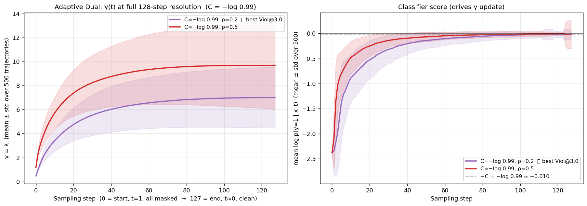
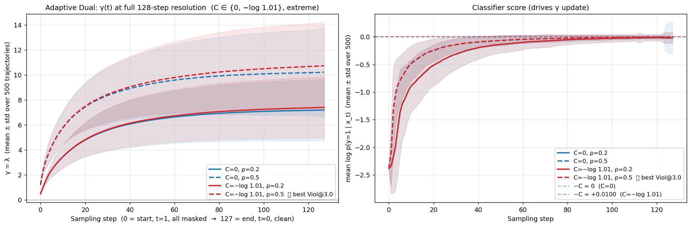
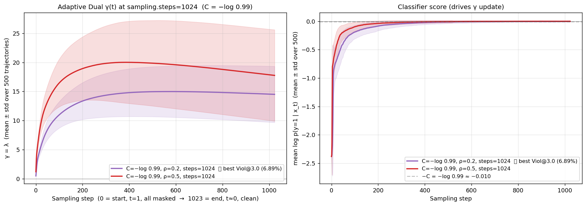
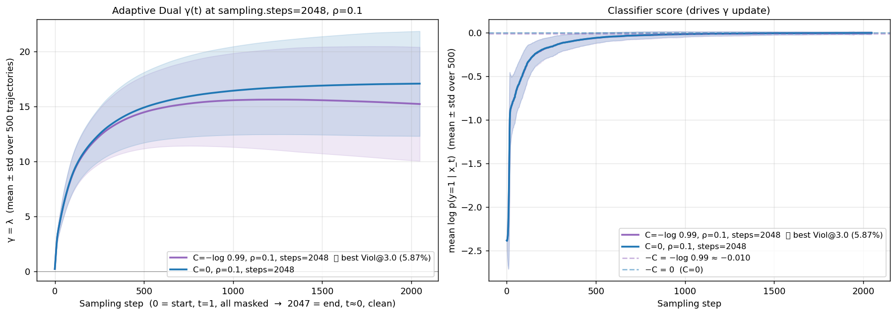

# SA-Constrained Evaluation — MDLM + D-CBG (Train τ = Eval τ Diagonal)

Reproducing [Cardei et al. NeurIPS 2025, *Constrained Discrete Diffusion* (arXiv:2503.09790)](https://arxiv.org/abs/2503.09790) Fig 4 LEFT (Synthetic Accessibility constraint), restricted to the matched-train/eval-τ diagonal.

**Date:** 2026-05-22.
**Setup:** QM9 SMILES, MDLM (absorbing-state diffusion, parameterization=subs, T=0, model=small/dit, length=32), `sampling.steps=128`, `seed=1`, N=1000.
For each `train τ ∈ {3.0, 3.5, 4.0, 4.5}`: classifier trained on binary label `SA ≤ τ`, then sample 1000 molecules with D-CBG γ conditioning on class 1, and evaluate violation at the matched eval τ.

---

## Pipeline (3 stages)

1. **SA labels** — QM9 dataset already contains an `sa_score` column (RDKit-computed). No preprocessing needed.
2. **Train D-CBG classifier** on QM9 with binary label `SA ≤ τ = class 1`. Tiny-classifier DIT, hidden_size=512, n_blocks=8, 28.4 M params, 25 000 steps.
3. **Sample** MDLM + D-CBG with `guidance.condition=1` (target = "accessible" class), 1000 molecules.

---

## Results — diagonal (train τ = eval τ) across γ

`Viol @ τ` = (# valid molecules with SA > τ) / (# valid molecules). N=1000 per cell.

| Diag Viol %    |   τ=3.0   |   τ=3.5   |   τ=4.0   |   τ=4.5   |
| :------------- | --------: | --------: | --------: | --------: |
| γ = 1          |     23.80 |     19.14 |     12.71 |     10.45 |
| **γ = 3**      | **13.50** |  **8.11** |  **9.56** |      5.76 |
| γ = 5          |   66.44 ⚠ |     10.93 |     11.77 |  **3.55** |
| γ = 10         |    N/A ❌ |    N/A ❌ |    N/A ❌ |      4.40 |
| **CDD paper**  |      50.5 |      48.6 |      46.1 |      44.7 |
| **Ours best**  | **13.50** |  **8.11** |  **9.56** |  **3.55** |
| Δ vs CDD       | **−37.0** | **−40.5** | **−36.5** | **−41.2** |

⚠ degraded validity (n_valid < 400). ❌ degenerate (n_valid < 10, ratios meaningless).

---

## Time-varying γ — static schedules + adaptive dual — train τ = eval τ = 3.0

Two families of γ(t), both motivated by the same observation: under absorbing-state
diffusion a token unmasks once and then freezes (`copy_flag` in `_cbg_denoise`),
so *when* the classifier signal is applied matters. The hard-constraint
intuition: keep γ small early (let unconditional model build valid skeletons),
ramp γ up late (force the last decisions into the SA ≤ 3 region).

All experiments below use N=500, seed=1, sampling.steps=128, classifier trained at τ=3.0.

### (A) Static schedules — γ predefined as a function of t

γ is a closed-form function of the normalized sampling time `t ∈ [eps, 1]` (t=1
fully masked, t→0 clean). Code: `diffusion.Diffusion._compute_gamma_t` +
`guidance.gamma_schedule / gamma_min / gamma_max` in `configs/guidance/cbg.yaml`.
Launcher: `sample_sa_dcbg_schedule.sh SCHED GMIN GMAX N_BATCHES BS TAU TAG`.

* **linear [1→5]**: γ(t) = 1 + 4·(1 − t), time-mean = 3 (matches baseline γ=3)
* **linear [1→8]**: γ(t) = 1 + 7·(1 − t), time-mean = 4.5 (more aggressive late)
* **quadratic [1→5]**: γ(t) = 1 + 4·(1 − t)², late ramp-up (time-mean ≈ 2.33)

### (B) Adaptive dual — γ is a Lagrangian dual variable (Algm 1)

γ ≡ λ is updated online per-sample from how well current `x_t` satisfies the
classifier-margin constraint. Derivation in `idea-stage/` (handwritten notes).

**Primal:** `min_q KL(q ‖ p)  s.t.  E_q[-log p(y|x)] ≤ C`
**Per-step update (per sample):**

```
λ ← clip( (λ - ρ·(log p(y|x_t) + C))_+ , 0, λ_max )
x_{t+1} ~ p(·|x_t) · p(y|·, x_t)^λ
```

Interpretation:
* `log p(y|x_t) < -C` → constraint violated → λ ↑ → stronger guidance next step.
* `log p(y|x_t) ≥ -C` → satisfied with margin → λ ↓ → relax guidance.

Code: `diffusion.Diffusion._diffusion_sample` (adaptive_dual branch) +
`guidance.gamma_schedule=adaptive_dual` in `configs/guidance/cbg.yaml`. Launcher:
`sample_sa_dcbg_adaptive.sh C ρ λ₀ λmax N_BATCHES BS TAU TAG`. λ is maintained
per-sample as a `(B,)` tensor — each trajectory has its own dual variable driven
by its own classifier score. Tested with λ₀=0, λ_max=50.

### Results — all schedules vs constant-γ baseline

All rows use train τ = eval τ = 3.0 (one classifier trained at SA ≤ 3.0,
evaluated at Viol@3.0 only), grouped below by `sampling.steps`. Bold = best per
column within each table. ⭐ = lowest Viol@3.0 across the whole document.
Adaptive-dual rows use λ_max=50, λ₀=0 unless the Setup says otherwise.

#### steps = 128 (default discretization)

Adaptive-dual rows sorted by C from loose to tight.

| Setup                              |  N   | Valid           | Unique  | Novel & SA≤3.0 | QED-novel-strict | Viol@3.0   |
| ---------------------------------- | :--: | --------------: | ------: | -------------: | ---------------: | ---------: |
| constant γ=3 (baseline)            | 1000 |     785 (78.5%) |     179 |         **73** |            0.442 |     13.50% |
| **(A) linear [1→5]**               |  500 |     361 (72.2%) | **250** |             60 |            0.508 |     13.02% |
| (A) linear [1→8] (aggressive)      |  500 |     369 (73.8%) |     247 |             55 |        **0.518** |     13.55% |
| (A) quadratic [1→5] (late ramp)    |  500 |     340 (68.0%) |     242 |             54 |            0.485 |     16.18% |
| (B) adaptive C=−log 0.6, ρ=0.5     |  500 |     354 (70.8%) |     183 |             30 |            0.475 |     16.38% |
| (B) adaptive C=−log 0.8, ρ=0.5     |  500 |     390 (78.0%) |     170 |             44 |            0.464 |     13.85% |
| (B) adaptive C=−log 0.8, ρ=1.0     |  500 |     353 (70.6%) |     134 |             37 |            0.454 |     21.81% |
| (B) adaptive C=−log 0.9, ρ=0.2     |  500 |     372 (74.4%) |     219 |             49 |            0.510 |     13.44% |
| (B) adaptive C=−log 0.9, ρ=0.5     |  500 |     386 (77.2%) |     173 |             47 |            0.475 |     13.21% |
| (B) adaptive C=−log 0.95, ρ=0.2    |  500 |     375 (75.0%) |     214 |             51 |            0.501 |     12.53% |
| (B) adaptive C=−log 0.95, ρ=0.5    |  500 |     386 (77.2%) |     172 |             53 |            0.469 |     12.18% |
| (B) adaptive C=−log 0.99, ρ=0.2    |  500 |     376 (75.2%) |     216 |             47 |            0.506 |     11.97% |
| (B) adaptive C=−log 0.99, ρ=0.5    |  500 |     387 (77.4%) |     166 |             58 |            0.471 |     13.18% |
| (B) adaptive C=0, ρ=0.2            |  500 |     375 (75.0%) |     216 |             46 |            0.504 |     12.00% |
| (B) adaptive C=0, ρ=0.5            |  500 |     387 (77.4%) |     167 |             57 |            0.470 |     12.14% |
| (B) adaptive C=−log 1.01, ρ=0.2    |  500 |     375 (75.0%) |     212 |             43 |            0.511 |     12.27% |
| (B) adaptive C=−log 1.01, ρ=0.5    |  500 |     382 (76.4%) |     163 |             50 |            0.467 |     11.78% |
| (B) adaptive C=−log 1.01, ρ=0.1, λ₀=2, λ_max=5 |  500 |     404 (80.8%) |     175 |             41 |            0.469 |      8.66% |
| **(B) adaptive C=−log 1.01, ρ=0.2, λ₀=2, λ_max=5** |  500 | 412 (**82.4%**) |     154 |             38 |            0.464 |  **8.25%** |
| (B) adaptive C=−log 1.01, ρ=0.5, λ₀=2, λ_max=5 |  500 |     383 (76.6%) |     105 |             33 |            0.436 |     16.45% |
| constant γ=3, steps=128             |  500 |     387 (77.4%) |     121 |             31 |            0.448 |     13.70% |

Rows with C ≤ 0 (C=0, C=−log 1.01) correspond to **theoretically unsatisfiable
constraints** (require p(y\|x) ≥ 1 or p > 1). The dual variable never reaches
the satisfied region, so λ ramps up and plateaus (γ ≈ 7 for ρ=0.2, ≈ 10 for
ρ=0.5) without hitting the λ_max=50 cap. Lowest Viol@3.0 at steps=128 is the
**warm-start** variant C=−log 1.01, λ₀=2, λ_max=5, ρ=0.2 (**8.25%**): capping
λ_max≈5 and warm-starting λ₀=2 cuts ~3.5 pp off the λ_max=50 / λ₀=0 row (11.78%)
and lifts validity to 82.4% (highest at steps=128) — the same overshoot +
early-ramp fix as at steps=1024. But here ρ=0.5 is *much* worse (16.45%): the
coarse 128-step grid unmasks many tokens per step, amplifying the late
λ-volatility that large ρ causes. Even so, the best steps=128 warm-start (8.25%)
is far above the steps=1024 numbers (~3–5%) — the step budget still dominates.

#### steps = 256 (2× finer grid — where the steep gains kick in)

All adaptive rows use C=−log 0.99, λ₀=2 unless noted.

| Setup                            |  N   | Valid           | Unique  | Novel & SA≤3.0 | QED-novel-strict | Viol@3.0   |
| -------------------------------- | :--: | --------------: | ------: | -------------: | ---------------: | ---------: |
| constant γ=3                     |  500 |     428 (85.6%) |     158 |             37 |            0.463 |      7.24% |
| adaptive ρ=0.2, λ_max=3.0        |  500 | 429 (**85.8%**) |     186 |         **46** |            0.471 |      7.46% |
| adaptive ρ=0.2, λ_max=3.5        |  500 |     425 (85.0%) |     170 |             39 |            0.464 |      6.59% |
| **adaptive ρ=0.2, λ_max=4.0**    |  500 |     424 (84.8%) |     166 |             40 |            0.468 |  **6.13%** |
| **adaptive ρ=0.2, λ_max=5.0**    |  500 |     424 (84.8%) |     164 |             40 |            0.467 |  **6.13%** |
| adaptive ρ=0.2, λ_max=6.0        |  500 |     426 (85.2%) |     163 |             33 |            0.458 |      7.75% |
| adaptive ρ=0.1, λ_max=5.0        |  500 |     428 (85.6%) | **189** |             44 |            0.466 |      7.24% |
| adaptive ρ=0.3, λ_max=5.0        |  500 |     422 (84.4%) |     137 |             36 |        **0.476** |      8.77% |
| adaptive ρ=0.2, λ₀=3, λ_max=5.0  |  500 |     410 (82.0%) |     101 |             28 |            0.450 |      9.76% |

Best at steps=256: **λ_max≈4–5, ρ=0.2, λ₀=2 (6.13%)** — same sweet spot as
steps=1024 (λ_max≈5, ρ≤0.2); λ_max=6, ρ=0.3, and λ₀=3 all degrade. Both methods
capture most of the 128→1024 gain by 256: constant γ=3 drops 13.70% → 7.24% over
128→256 (over half the total fall to 4.61% at 1024), then only 7.24% → 4.61% over
the much larger 256→1024 jump — diminishing returns, but 1024 is still
meaningfully better, so 256 is a fast-iteration grid, not a replacement.
Warm-start adaptive stays ahead of constant γ=3 (6.13% vs 7.24%), ~0.7σ at N=500.

#### steps = 512 (4× finer grid)

All adaptive rows use C=−log 0.99, λ₀=2 unless noted.

| Setup                            |  N   | Valid           | Unique  | Novel & SA≤3.0 | QED-novel-strict | Viol@3.0   |
| -------------------------------- | :--: | --------------: | ------: | -------------: | ---------------: | ---------: |
| constant γ=3                     |  500 |     437 (87.4%) |     193 |             51 |        **0.479** |      6.18% |
| adaptive ρ=0.1,  λ_max=5.0       |  500 |     436 (87.2%) |     188 |             51 |            0.460 |      6.19% |
| adaptive ρ=0.12, λ_max=5.0       |  500 |     431 (86.2%) |     181 |             50 |            0.459 |      5.80% |
| adaptive ρ=0.15, λ_max=5.0       |  500 |     437 (87.4%) |     175 |         **52** |            0.459 |      5.72% |
| adaptive ρ=0.2,  λ_max=5.0       |  500 |     442 (88.4%) |     178 |             50 |            0.460 |      5.66% |
| adaptive ρ=0.15, λ_max=4.0       |  500 | 443 (**88.6%**) |     188 |             47 |            0.466 |      7.22% |
| **adaptive ρ=0.15, λ₀=1, λ_max=5.0** | 500 | 418 (83.6%) | **194** |             50 |            0.470 |  **5.26%** |

Lowest at steps=512 is **ρ=0.15, λ₀=1, λ_max=5 (5.26%)**, with ρ=0.12–0.2 at
λ_max=5 clustered at 5.7–5.8%; λ_max=4 (7.22%) is worse, confirming λ_max≈5
again. CBG γ=3 = 6.18%. As at every grid, warm-start adaptive sits at/below CBG
γ=3, but the gaps (~0.5–0.9 pp) stay within N=500 noise.

**Steps ladder (headline configs).** Constant γ=3 vs warm-start adaptive
(ρ=0.2, λ₀=2, λ_max=5) Viol@3.0: 128 → 13.70 / 8.25%* · 256 → 7.24 / 6.13% ·
512 → 6.18 / 5.66% · 1024 → 4.61 / 3.30% · 2048 → 4.56 / —. (*128 used
C=−log 1.01.) The step budget is the dominant lever; warm-start adaptive is
nominally below constant γ=3 at every rung, all within N=500 noise.

#### steps = 1024 (8× finer grid — overshoot / cap / warm-start ablation)

The default-λ_max=50 dual overshoots γ to a ~15 plateau here; the `λ_max=4` rows
cap the plateau and the `λ₀, λ_max=5` rows add a warm start. See the λ_max
ablation subsection for the mechanism.

| Setup                                           |  N   | Valid           | Unique  | Novel & SA≤3.0 | QED-novel-strict | Viol@3.0   |
| ----------------------------------------------- | :--: | --------------: | ------: | -------------: | ---------------: | ---------: |
| (B) adaptive C=−log 0.99, ρ=0.2 (λ_max=50)      |  500 |     450 (90.0%) |     154 |             54 |        **0.475** |      6.89% |
| (B) adaptive C=−log 0.99, ρ=0.5 (λ_max=50)      |  500 |     433 (86.6%) |     129 |         **58** |            0.460 |      9.47% |
| (B) adaptive C=−log 0.99, ρ=0.1, λ_max=4        |  500 |     434 (86.8%) | **222** |             44 |            0.472 |      7.83% |
| (B) adaptive C=−log 0.99, ρ=0.2, λ_max=4        |  500 |     451 (90.2%) |     190 |             48 |            0.462 |      4.66% |
| (B) adaptive C=−log 0.99, ρ=0.5, λ_max=4        |  500 |     453 (90.6%) |     174 |             43 |            0.473 |      5.74% |
| (B) adaptive C=−log 0.99, ρ=0.2, λ₀=1, λ_max=5  |  500 |     434 (86.8%) |     171 |             47 |            0.471 |      5.30% |
| **(B) adaptive C=−log 0.99, ρ=0.1, λ₀=2, λ_max=5** ⭐ |  500 | 445 (89.0%) |   176 |             46 |            0.469 | **3.15%** |
| (B) adaptive C=−log 0.99, ρ=0.2, λ₀=2, λ_max=5  |  500 |     454 (90.8%) |     161 |             40 |            0.451 |      3.30% |
| (B) adaptive C=−log 0.99, ρ=0.5, λ₀=2, λ_max=5  |  500 |     456 (91.2%) |     134 |             36 |            0.450 |      7.24% |
| (B) adaptive C=−log 0.99, ρ=0.1, λ₀=3, λ_max=5  |  500 | 469 (**93.8%**) |     169 |             39 |            0.458 |      5.33% |
| (B) adaptive C=−log 0.99, ρ=0.2, λ₀=3, λ_max=5  |  500 |     458 (91.6%) |     157 |             41 |            0.450 |      5.02% |
| (B) adaptive C=−log 0.99, ρ=0.2, λ₀=3, λ_max=10 |  500 |     457 (91.4%) |     141 |             48 |            0.453 |      7.00% |
| constant γ=3                                    |  500 |     456 (91.2%) |     195 |             48 |            0.463 |      4.61% |

⭐ = document-wide lowest Viol@3.0 (within N=500 noise of constant γ=3; ρ=0.2
ties at 3.30%). Bold = best per column in this table.

#### steps = 2048 (16× finer grid)

| Setup                              |  N   | Valid           | Unique  | Novel & SA≤3.0 | QED-novel-strict | Viol@3.0   |
| ---------------------------------- | :--: | --------------: | ------: | -------------: | ---------------: | ---------: |
| (B) adaptive C=−log 0.99, ρ=0.1    |  500 | 443 (**88.6%**) |     188 |         **54** |            0.464 |      5.87% |
| (B) adaptive C=0, ρ=0.1            |  500 |     441 (88.2%) |     188 |             50 |            0.460 |      6.35% |
| **constant γ=3**                   |  500 |     439 (87.8%) | **191** |             35 |        **0.465** |  **4.56%** |

The `steps=1024` / `steps=2048` rows increase the sampling-step discretization
(default 128) at the cost of ~8×–16× wall-clock per sample. For the
adaptive-dual rows we also reduce ρ to keep the per-step λ update smooth; the
"more steps + smaller ρ" recipe drives adaptive Viol@3.0 down to 5.87%.
**But the same step refinement on plain constant γ=3 does even better — 4.61%
at steps=1024 and 4.56% at steps=2048, making it the best *non-adaptive* config
(nominally edged by the warm-start dual at 3.15% ⭐, though within N=500 noise —
see the λ_max ablation).**
Either way the step budget is the dominant lever (vs baseline constant γ=3 at
13.50% / steps=128, and CDD's reported MDLM γ=3 row at 50.5%). The two
trajectory sections below explain the mechanism for the adaptive rows; the
constant-γ step sweep is analyzed in its own subsection.

### λ trajectory at full 128-step resolution — C = −log 0.99 (Algm 1 with per-step JSON dump)



These two runs (the tightest C tested) were sampled with the updated code that
dumps the **full per-step, per-sample** trajectory to `<run>_traj.json`
(125 batches × 128 steps × 4 samples = 500 trajectories per config). Shaded
band = ±1 std across all 500 sample-level γ values per step.

| step  | ρ=0.2 γ (mean ± std) | ρ=0.5 γ (mean ± std) |
| ----: | -------------------: | -------------------: |
|     0 |        0.47 ± 0.00   |        1.19 ± 0.00   |
|    32 |        5.66 ± 1.75   |        8.36 ± 2.33   |
|    64 |        6.63 ± 2.17   |        9.40 ± 2.99   |
|    96 |        6.94 ± 2.40   |        9.66 ± 3.35   |
|   127 |        7.01 ± 2.54   |        9.69 ± 3.74   |

Observations:

* **Neither γ decays back to 0 at this C** — completely different shape from
  the C=−log 0.6/0.8 runs (which peaked at step 32 then collapsed). With
  C=−log 0.99 the constraint `p(y|x) ≥ 0.99` is effectively unreachable, so
  complementary slackness never triggers and λ monotonically rises to a
  high plateau.
* **ρ=0.2 plateaus around γ ≈ 7 with narrow std (~2.5)**; ρ=0.5 plateaus
  much higher (≈ 9.7) with wider std (~3.7).
* **The wider, higher γ band for ρ=0.5 is exactly why it loses on Viol@3.0
  here** (13.18% vs 11.97%): some samples get over-perturbed off the valid
  SMILES manifold by γ ≈ 13 spikes. ρ=0.2 keeps γ in a tighter, lower band
  that's still strong enough to drive the constraint while not destroying
  validity.
* **Right panel** shows both configs satisfy `log p(y|x_t) ≈ 0` (i.e.
  p(y|x) → 1) by step ~50–80; ρ=0.5 gets there faster but at the cost of
  the higher γ plateau.

### λ trajectory — extreme C: C=0 and C=−log 1.01 (unsatisfiable)



Both C values define **theoretically unsatisfiable** constraints
(`p(y|x) ≥ 1` for C=0 and `p(y|x) ≥ 1.01` for C=−log 1.01). The dual update
therefore never lands in the "satisfied" region; λ rises until its
trajectory plateau is set by ρ (and indirectly by the classifier's saturation
of `log p(y|x_t) → 0`).

| step  | C=0 ρ=0.2 | C=0 ρ=0.5 | C=−log 1.01 ρ=0.2 | C=−log 1.01 ρ=0.5 |
| ----: | --------: | --------: | ----------------: | ----------------: |
|     0 |      0.48 |      1.19 |              0.48 |              1.20 |
|    32 |      5.69 |      8.48 |              5.74 |              8.57 |
|    64 |      6.70 |      9.66 |              6.80 |              9.89 |
|    96 |      7.05 |     10.06 |              7.21 |             10.45 |
|   127 |      7.18 |     10.22 |              7.40 |             10.73 |

Observations:

* **C=0 and C=−log 1.01 produce nearly identical trajectories.** Differing
  by `ΔC = −0.01`, the cumulative effect over 128 steps is just `−ρ·ΔC·128`
  ≈ `0.5×0.01×128 = 0.64` extra γ at ρ=0.5, ≈ 0.26 at ρ=0.2. Visually
  the C=0 and C=−log 1.01 lines overlap heavily within each ρ.
* **None of these runs hit the λ_max = 50 cap.** The plateau is set by how
  quickly `log p(y|x_t)` decays to 0 (the classifier becomes confident).
  Once `log_p_y ≈ 0`, the dual update reduces to a constant drift
  `λ ← λ − ρ·C`, which is tiny.
* **Within ρ=0.5, the small extra push from C=−log 1.01 (γ plateau ≈ 10.7
  vs 10.2) coincides with the lowest Viol@3.0 among the steps=128 runs (11.78%).**
  Within ρ=0.2, the same effect is smaller and Viol@3.0 differences are
  noise-level (12.00 vs 12.27).
* **Overall the curves confirm the previous finding:** once C is tight
  enough that the constraint is effectively unreachable, the trajectory
  shape is mostly determined by ρ (which sets the plateau height). The
  exact value of C below the saturation point contributes only a small
  drift on top.

### λ trajectory at sampling.steps=1024 — same C=−log 0.99, 8× finer time grid



Same C=−log 0.99 and ρ values as the previous section but with
`sampling.steps=1024` (8× the default 128). Each batch produces a
trajectory of length 1024, cost ~8× more wall-clock per sample.

| step  | ρ=0.2 γ (mean ± std)   | ρ=0.5 γ (mean ± std)   |
| ----: | ---------------------: | ---------------------: |
|     0 |          0.47 ± 0.00   |          1.19 ± 0.00   |
|   256 |       **14.01** ± 3.54 |       **19.55** ± 6.04 |
|   512 |         14.97 ± 4.31   |         19.84 ± 7.39   |
|   768 |         14.87 ± 4.62   |         18.94 ± 7.73   |
|  1023 |         14.51 ± 4.83   |         17.77 ± 7.86   |

Observations:

* **γ plateau roughly doubles** vs steps=128: ρ=0.2 ≈ 14.5 (was 7.0),
  ρ=0.5 ≈ 19.8 (was 9.7). Same per-step magnitude of `log_p + C`, but
  8× more steps to accumulate before the classifier saturates → larger
  total drift before equilibrium.
* **log p(y|x_t) reaches near-zero by step ~100** (out of 1024). The
  remaining 900+ steps run with constraint already "nominally satisfied"
  but with very high γ still in play — extremely fine-grained correction
  in the late absorbing-decode phase.
* **ρ=0.5 has a markedly wider per-sample std band** (~7-8 vs ~5 for
  ρ=0.2). Despite the higher γ peak it loses on Viol@3.0 (9.47 vs 6.89)
  — same over-perturbation pattern as in v3, just at a higher absolute γ.
* **Slow late decline** in γ for both configs (ρ=0.2: 14.97 → 14.51,
  ρ=0.5: 19.84 → 17.77): once `log p ≈ −0.001 > −C = −0.010`, the dual
  update has a tiny negative drift `−ρ·(−0.001 + 0.010)`, slowly
  walking λ back down.

Why steps=1024 wins on Viol@3.0 AND Validity simultaneously:
1. With 1024 absorbing-decode steps, each step unmasks fewer tokens →
   the high γ from the dual update has more granular per-token control,
   producing fewer mis-unmask events that would land off the valid SMILES
   manifold.
2. λ-driven guidance, once γ is high, can correct mistakes over many
   steps rather than one shot — so a single bad unmask doesn't freeze
   the trajectory in a violating state.

### λ trajectory at sampling.steps=2048, ρ=0.1 — best uncapped (λ_max=50) adaptive-dual Viol@3.0 (5.87%)



Same family as v5 but pushed further: 2048 sampling steps and a smaller
stepsize ρ=0.1. Two C values: −log 0.99 (tight-but-satisfiable boundary)
and 0 (unreachable).

| step  | C=−log 0.99 γ (mean ± std) | C=0 γ (mean ± std)   |
| ----: | -------------------------: | -------------------: |
|     0 |              0.24 ± 0.00   |        0.24 ± 0.00   |
|   512 |           **14.55** ± 3.33 |     **14.99** ± 3.23 |
|  1024 |             15.60 ± 4.30   |       16.49 ± 4.05   |
|  1536 |             15.57 ± 4.88   |       16.93 ± 4.50   |
|  2047 |             15.24 ± 5.18   |       17.09 ± 4.78   |

Observations:

* **γ plateau ≈ 15–17, only slightly higher than the v5 (steps=1024, ρ=0.2)
  ≈ 14.5–20**. Halving ρ counter-balances doubling steps — the total drift
  budget per "unit time" is roughly preserved.
* **C=0 (blue) trajectory keeps creeping up over the whole 2048 steps**
  (15 → 17), while C=−log 0.99 (purple) stops climbing after step ~700 and
  slowly drifts down (15.6 → 15.2). The negative steady-state drift is
  `−ρ·C ≈ −0.001` per step ≈ `−2` over 2048 steps for C=−log 0.99,
  consistent with the observed decline.
* **C=−log 0.99 beats C=0 on Viol@3.0** (5.87 vs 6.35%, Δ −0.48 pp). The
  *lower* γ plateau wins — too much γ over-perturbs even at this fine
  discretization. So in the (large-steps, small-ρ) regime, the small
  positive C ≈ 0.01 acts as a gentle "release valve" on λ.
* **`log p(y|x_t)` reaches near-0 by step ~100** (out of 2048) for both
  configs — the *remaining 95% of sampling* runs with the constraint
  nominally satisfied but with γ ≈ 15–17 still actively shaping the
  unmask decisions. This is consistent with the validity gain
  (88-89%, vs ~75% at steps=128): high γ alone is not the problem, what
  matters is when and how it's applied.

The C=−log 0.99, ρ=0.1, steps=2048 config produces the **lowest Viol@3.0
among the uncapped (λ_max=50) adaptive-dual configs (5.87%)** (constant γ=3 at
the same step budget is lower at 4.56%, and the capped warm-start dual lower
still at 3.15% — see the constant-γ step-sweep and λ_max ablation subsections),
with Validity
88.6% and Unique 188 — and on the
Viol@τ side the curve flattens almost completely: 5.87 / 4.97 / 4.06 /
4.06% at τ=3.0/3.5/4.0/4.5, indicating the residual violators cluster in
a small set of truly hard SA > 4 molecules.

### Findings

**Static schedules (A):**

1. **Linear [1→5] beats constant γ=3 on Viol@3.0** (13.02% vs 13.50%), at the
   cost of 6 pp validity. Linear [1→8] is roughly tied (13.55%) but pushes
   QED higher (0.518).
2. **Quadratic (late ramp) is the worst on Viol@3.0** (16.18%, +2.7 pp vs
   baseline). Confirms the absorbing-tokens-freeze hypothesis — γ ≈ 0
   through the first half means many tokens unmask unguided and can't be
   fixed even when γ later spikes.
3. **Static schedules trade 5–10 pp validity for diversity and QED**
   (unique 242–250 vs 179, QED 0.49–0.52 vs 0.44).

**Adaptive dual (B):**

4. **Tighter C helps — but the optimal ρ flips with C.** Sweep over
   C ∈ {−log 0.6, −log 0.8, −log 0.9, −log 0.95, −log 0.99, 0, −log 1.01}:
   - With ρ=0.5: 16.38 → 13.85 → 13.21 → **12.18** → 13.18 → 12.14 → **11.78**
   - With ρ=0.2:    (—)  →  (—)  → 13.44 → 12.53 → **11.97** → 12.00 → 12.27
   ρ=0.2 wins near the "barely-unsatisfiable" boundary (C=−log 0.95/0.99);
   ρ=0.5 wins both in the easy regime (C=−log 0.6..0.9) and in the
   strictly-unsatisfiable regime (C ≤ 0). **The Pareto front requires
   choosing (C, ρ) jointly, not independently.**
5. **Once C is below the classifier's saturation point, only ρ matters.**
   At C ≤ 0 the constraint is mathematically unreachable, so the trajectory
   plateau is set by ρ (≈ 7 for ρ=0.2, ≈ 10 for ρ=0.5). Pushing C from 0 to
   −log 1.01 only adds a slow drift of `−ρ·C` per step on top.
6. **C=−log 1.01, ρ=0.5 is the best Viol@3.0 at steps=128** (11.78%),
   beats constant γ=3 baseline (13.50%) and best static schedule linear
   [1→5] (13.02%), with validity 76.4%.
7. **Increasing sampling.steps from 128 to 1024 is a much larger lever
   than tuning (C, ρ).** At C=−log 0.99 the same dual algorithm goes from
   Viol@3.0 = 11.97% (ρ=0.2, 128 steps) → **6.89% (ρ=0.2, 1024 steps)**,
   with validity *also* rising from 75.2% → 90.0%. **Sample-step
   refinement helps the dual algorithm in both directions at once:**
   - per-token decisions are finer → fewer mis-unmask events that wreck
     validity;
   - high γ has more chances to correct mistakes → tighter constraint
     satisfaction;
   - the cost is ~8× wall-clock per sample.
8. **Pushing further: steps=2048 + ρ=0.1 sets a new uncapped (λ_max=50) adaptive-dual low (5.87%).** Doubling
   steps and halving ρ keeps the per-step λ drift similar (≈ same plateau)
   but produces an even smoother trajectory. C=−log 0.99 (5.87%) beats
   C=0 (6.35%) again, because the small positive C ≈ 0.01 introduces a
   gentle steady-state decline that prevents γ from compounding upward
   over the long sampling horizon — same trend as in v3 (steps=128) but
   the gap is larger when accumulated over 2048 steps.
7. **Looser threshold (C=−log 0.6) is the worst adaptive config.** λ relaxes
   to 0 too early because the easier bound is satisfied with little effort,
   leaving the final token-unmask decisions unguided.
8. **Larger stepsize (ρ=1.0) over-shoots and destabilizes.** Peak λ ≈ 7 in
   the first 32 steps pushes samples off the valid SMILES manifold; Viol@3.0
   hits 21.8% (worst in the document). **ρ should stay in [0.2, 0.5].**
9. **ρ inside the stable range (0.2 vs 0.5) is a diversity-vs-accuracy
   trade-off** for any tight-but-satisfiable C:
   - ρ=0.2 → Unique ≈ 212–219, QED ≈ 0.50, Viol slightly higher
   - ρ=0.5 → Unique ≈ 163–173, QED ≈ 0.47, Viol lower (when in winning regime)
   Intuition: larger ρ pulls λ up faster → stronger guidance → mode collapse
   toward classifier's high-confidence regions → less unique, lower QED.

**A vs B head-to-head:**

* Best **Viol@3.0**: **adaptive warm-start λ₀=2, λ_max=5, ρ=0.1, steps=1024
  (3.15%)** ⭐ document-wide lowest (ρ=0.2 ties at 3.30%; within N=500 noise of
  constant γ=3 — not yet a clean win; see λ_max ablation Finding 4). Among
  *non-adaptive*
  configs the best is constant γ=3, steps=2048 (4.56%), with constant γ=3
  steps=1024 right behind (4.61%); both beat the default-λ_max adaptive-dual
  (C=−log 0.99, ρ=0.1, steps=2048, 5.87%). All crush baseline constant γ=3 at
  steps=128 (13.50%) and best static linear [1→5] (13.02%). Key nuance: the
  default adaptive-dual loses to constant γ=3 purely from **γ overshoot**;
  capping λ_max≈4 ties it and warm-starting λ₀=2 nominally edges it (3.15%,
  but within N=500 noise — not yet a statistically clean win; see λ_max ablation).
* Best **validity**: adaptive C=−log 0.8 ρ=0.5 (78.0%, ties baseline);
  ρ=0.5 adaptive runs at C=−log 0.9 / 0.95 also reach 77.2%.
* Best **uniqueness**: static linear [1→5] (250); adaptive ρ=0.2 runs reach ≈215.
* Best **QED**: static linear [1→8] (0.518); adaptive C=−log 0.9 ρ=0.2 (0.510).

Take-away: **adaptive dual now wins on the strict-constraint metric (Viol@3.0)**
when C is tight enough, and does so without paying the validity tax that static
schedules pay. Static schedules still win on QED/diversity. The two approaches
are genuinely complementary.

> **Caveat (see next subsection):** this head-to-head fixes adaptive-dual at
> steps=1024/2048 but compares it to constant γ=3 at *steps=128*. At a matched
> step budget the ranking flips — constant γ=3 at steps≥1024 beats every
> adaptive-dual config on Viol@3.0. The adaptive machinery's apparent win is
> mostly a step-budget artifact.

### Constant γ=3 across sampling.steps — the step budget is the real lever

Same step-refinement sweep as the adaptive-dual rows above, but on the
*simplest possible* config: constant γ=3 (no schedule, no dual variable).
Train τ = eval τ = 3.0, N=500, seed=1, run 2026-06-05. Launcher now takes a
5th `STEPS` arg: `sample_sa_dcbg.sh GAMMA N_BATCHES BS TAU STEPS`. The three
`constant γ=3, steps=*` rows are folded into the main table above; the table
below repeats them with the full Viol@τ breakdown.

| steps | Valid           | Unique | Novel & SA≤3.0 | QED-novel-strict | Viol@3.0  | Viol@3.5/4.0/4.5      |
| ----: | --------------: | -----: | -------------: | ---------------: | --------: | --------------------- |
|   128 | 387 (77.4%)     |    121 |             31 |            0.448 |   13.70%  | 12.66 / 11.63 / 11.11 |
|  1024 | 456 (**91.2%**) |    195 |             48 |            0.463 | **4.61%** | 3.29 / 3.29 / 3.29    |
|  2048 | 439 (87.8%)     |    191 |             35 |            0.465 |   4.56%   | 3.19 / 3.19 / 3.19    |

Observations:

1. **The step budget dominates everything else.** Going 128→1024 cuts Viol@3.0
   from 13.70% → 4.61% *and* raises validity 77.4% → 91.2% — a bigger move than
   any (C, ρ) tuning in the adaptive sweep. steps=128 here (13.70%) reproduces
   the N=1000 constant γ=3 baseline (13.50%), confirming N=500 is a faithful
   comparison point.
2. **The gain saturates by ~1024 steps.** 2048 barely moves vs 1024 (4.56% vs
   4.61%), and validity actually dips slightly (91.2% → 87.8%). Past ~1024 steps
   the extra wall-clock buys essentially nothing for constant γ.

**Head-to-head at a matched step budget — constant γ=3 wins:**

| Method @ steps                          | Viol@3.0  | Valid | Unique | Novel |
| --------------------------------------- | --------: | ----: | -----: | ----: |
| **constant γ=3, steps=1024**            | **4.61%** | 91.2% |    195 |    48 |
| adaptive C=−log 0.99 ρ=0.2, steps=1024  |     6.89% | 90.0% |    154 |    54 |
| **constant γ=3, steps=2048**            | **4.56%** | 87.8% |    191 |    35 |
| adaptive C=−log 0.99 ρ=0.1, steps=2048   |   5.87% | 88.6% |    188 |    54 |

At equal step budgets the **simplest baseline beats every adaptive-dual config
on Viol@3.0** (4.6% vs 5.9% at 2048) and on uniqueness; adaptive only edges it
out on Novel-strict count (54 vs 35–48). This revises the "adaptive dual wins
on Viol@3.0" conclusion above: that win held only when adaptive
(steps=1024/2048) was compared against constant γ=3 at *steps=128*. **The real
lever was the step budget, not the dual schedule** — a sobering but honest
result for the adaptive-dual direction. (But see the next subsection: the loss
was largely **γ overshoot**, and capping `λ_max≈4` recovers the gap to a tie.)

Reproduction:

```bash
bash sample_sa_dcbg.sh 3 125 4 3.0 128   # → mdlm_dcbg_sa_gamma3_n500_trainTau3.0_results.csv
bash sample_sa_dcbg.sh 3 125 4 3.0 1024  # → ..._steps1024_results.csv
bash sample_sa_dcbg.sh 3 125 4 3.0 2048  # → ..._steps2048_results.csv
```

### λ_max ablation — capping γ near the sweet spot closes the gap to constant γ=3

The constant-γ result above raised the obvious question: the adaptive-dual rows
drive γ to a ~15 plateau (see the steps=1024/2048 trajectory sections), yet the
γ-sweep diagonal shows the *best* constant γ for this task is ≈3. So is the dual
schedule's loss just **γ overshoot**? We test this directly by capping the dual
variable at `λ_max=4` (vs the default 50), fixing C=−log 0.99, steps=1024, N=500,
λ₀=0, and sweeping ρ. Launcher: `sample_sa_dcbg_adaptive.sh C ρ λ₀ λmax 125 4 3.0 n500 1024`.

All rows of this ablation are folded into the main results table above — the two
default-λ_max=50 `steps=1024` rows, the three `λ_max=4` rows, and the warm-start
rows (`λ₀=1/2, λ_max=5`; `λ₀=3, λ_max=5` at ρ=0.1/0.2; `λ₀=3, λ_max=10`), against
the `constant γ=3, steps=1024` reference. Full Viol@τ breakdowns: λ_max=4 ρ=0.2
→ 4.66 / 4.43 / 3.77 / 3.55%; warm-start λ₀=2 (ρ=0.1) → 3.15 / 3.15 / 2.92 /
2.92% ⭐ and λ₀=2 (ρ=0.2) → 3.30 / 3.08 / 3.08 / 3.08% (the flattest curves in
the document); λ₀=3 λ_max=10 → 7.00 / 6.56 / 5.69 / 5.25%.
All use C=−log 0.99, steps=1024, N=500. See Finding 4 for the warm-start
sensitivity sweep and the N=500-noise caveat.

Findings:

1. **Overshoot confirmed: λ_max=4 beats λ_max=50 at every matched ρ.** ρ=0.2:
   4.66% vs 6.89%; ρ=0.5: 5.74% vs 9.47%. Pulling the γ plateau from ~15 down to
   ~4 (near the γ-sweep sweet spot) is the single biggest lever inside the
   adaptive family — the dual schedule's loss to constant γ=3 was mostly γ
   overshoot, not the schedule shape per se.
2. **ρ is U-shaped under a low cap; optimum ρ=0.2.** With λ_max=50 the plateau
   height is set by ρ (smaller ρ → lower plateau → better). With λ_max=4 the
   plateau is *fixed at 4*, so ρ only controls (a) how fast λ ramps to the cap
   and (b) late-phase volatility around it. Too small (ρ=0.1) → slow ramp → long
   under-guided early window → absorbing tokens freeze in violation (7.83%); too
   large (ρ=0.5) → λ bounces around the cap late → extra perturbation (5.74%);
   ρ=0.2 avoids both (4.66%). **The two knobs decouple: λ_max sets the target γ,
   ρ sets the ramp speed / stability.**
3. **Capped λ_max=4 (λ₀=0) ties constant γ=3.** Best such row (ρ=0.2, 4.66%) ≈
   constant γ=3 (4.61%) — a noise-level tie at N=500 — and matches it on
   Valid/Unique too. The residual gap is the **λ₀=0 early ramp**: constant γ=3
   applies γ=3 from step 1, while the λ₀=0 dual starts at 0 and spends the first
   ~10–20 steps under-guided (absorbing tokens unmask there and freeze).
4. **Warm-starting the dual (λ₀=2, λ_max=5, ρ=0.1–0.2) gives the document-wide
   lowest Viol@3.0 (3.15%) ⭐ — but the margin over constant γ=3 is within
   N=500 noise.** Starting λ at 2 removes the under-guided early window while
   leaving headroom (λ_max=5) for per-sample upward correction; the dual settles
   around γ≈2–5 driven by each trajectory's own classifier score. Nominally
   3.15% (ρ=0.1; ρ=0.2 ties at 3.30%) vs constant γ=3's 4.61% (−1.46 pp),
   validity tied (89–91%), Viol@τ uniformly lower (≈2.9–3.1% at τ=3.5/4.0/4.5).
   **But at Viol≈4% with n_valid≈450 the SE is ≈0.9 pp, so −1.46 pp ≈ 1.5σ is not
   significant (p≈0.13).** A warm-start sensitivity sweep confirms the band is noisy, not a
   clean optimum:

   | warm-start config         | Viol@3.0 | Valid | Unique |
   | ------------------------- | -------: | ----: | -----: |
   | λ₀=2, λ_max=5, ρ=0.1      |    3.15% | 89.0% |    176 |
   | λ₀=2, λ_max=5, ρ=0.2      |    3.30% | 90.8% |    161 |
   | λ₀=2, λ_max=5, ρ=0.5      |    7.24% | 91.2% |    134 |
   | λ₀=1, λ_max=5, ρ=0.2      |    5.30% | 86.8% |    171 |
   | λ₀=3, λ_max=5, ρ=0.1      |    5.33% | 93.8% |    169 |
   | λ₀=3, λ_max=5, ρ=0.2      |    5.02% | 91.6% |    157 |
   | λ₀=3, λ_max=10, ρ=0.2     |    7.00% | 91.4% |    141 |
   | constant γ=3 (ref)        |    4.61% | 91.2% |    195 |

   Reading: (i) **At λ₀=2, λ_max=5, small ρ wins and ρ=0.5 fails:** ρ=0.1/0.2 →
   3.15 / 3.30% (statistically tied) vs ρ=0.5 → 7.24% (≈4 pp / >3σ worse, Unique
   collapses to 134). The ρ=0.5 jump confirms the "too-large ρ → λ bounces around
   the cap late → overshoot" mechanism. Crucially ρ=0.1 is *good* here, whereas
   at λ_max=4 with **cold start λ₀=0** ρ=0.1 was the *worst* (7.83%) — warm-start
   already covers the early window that a slow cold ramp leaves under-guided, so
   small ρ stops hurting. The pieces fit. (ii) **λ_max=10 is clearly worse
   (7.00%, ~3σ above the λ_max=5 rows)** — headroom past the sweet cap re-introduces
   overshoot (the λ_max=50 failure mode). (iii) **The λ₀ cross-section at ρ=0.2
   (λ₀=1/2/3 → 5.30 / 3.30 / 5.02%) is non-monotonic** — λ₀=2 lowest but with
   noisy ~5% neighbours, and the λ₀=2 ρ=0.1/0.2 runs share seed=1 so they are
   *correlated*, not two independent confirmations. **Robust: λ_max≈5 sweet cap,
   ρ≤0.2 with warm-start. Unresolved at N=500: whether λ₀=2 ~3.2% genuinely beats
   constant γ=3 (4.61%) — each best config is only ~1.5σ below it.**

   **Honest status: the mechanism is established (cap γ near the sweet spot +
   warm-start to kill the early-ramp penalty), but a *statistically clean* win
   of adaptive-dual over a well-tuned constant γ is NOT yet demonstrated** — the
   best config only ties/edges constant γ=3 inside N=500 error bars. Confirming
   it requires re-running the λ₀=2 winner and constant γ=3 at N=1000 (SE → ~0.6 pp).

Reproduction:

```bash
for rho in 0.1 0.2 0.5; do
  bash sample_sa_dcbg_adaptive.sh 0.01005 $rho 0.0 4.0 125 4 3.0 n500 1024   # λ_max=4 cap
done
# Warm-start sweep (λ_max=5). λ₀=2 ρ=0.1/0.2 give the doc-best ~3.2% (ρ=0.1 → 3.15% ⭐):
for rho in 0.1 0.2 0.5; do
  bash sample_sa_dcbg_adaptive.sh 0.01005 $rho 2.0 5.0 125 4 3.0 n500 1024
done
bash sample_sa_dcbg_adaptive.sh 0.01005 0.2 1.0  5.0 125 4 3.0 n500 1024   # λ₀=1
bash sample_sa_dcbg_adaptive.sh 0.01005 0.1 3.0  5.0 125 4 3.0 n500 1024   # λ₀=3
bash sample_sa_dcbg_adaptive.sh 0.01005 0.2 3.0  5.0 125 4 3.0 n500 1024   # λ₀=3
bash sample_sa_dcbg_adaptive.sh 0.01005 0.2 3.0 10.0 125 4 3.0 n500 1024   # λ₀=3, λ_max=10 (overshoot → 7.00%)
```

### Reproduction

```bash
# (A) Static schedules — 3 runs, N=500 each
bash sample_sa_dcbg_schedule.sh linear_increasing 1.0 5.0 125 4 3.0 n500
bash sample_sa_dcbg_schedule.sh linear_increasing 1.0 8.0 125 4 3.0 n500
bash sample_sa_dcbg_schedule.sh quadratic_increasing 1.0 5.0 125 4 3.0 n500

# (B) Adaptive dual — 7 runs total, N=500 each
#   First wave (initial sweep)
bash sample_sa_dcbg_adaptive.sh 0.5108 0.5 0.0 50.0 125 4 3.0 n500   # C=-log 0.6, ρ=0.5
bash sample_sa_dcbg_adaptive.sh 0.2231 0.5 0.0 50.0 125 4 3.0 n500   # C=-log 0.8, ρ=0.5
bash sample_sa_dcbg_adaptive.sh 0.2231 1.0 0.0 50.0 125 4 3.0 n500   # C=-log 0.8, ρ=1.0
#   Second wave (tighter C)
bash sample_sa_dcbg_adaptive.sh 0.1054 0.2 0.0 50.0 125 4 3.0 n500   # C=-log 0.9,  ρ=0.2
bash sample_sa_dcbg_adaptive.sh 0.1054 0.5 0.0 50.0 125 4 3.0 n500   # C=-log 0.9,  ρ=0.5
bash sample_sa_dcbg_adaptive.sh 0.0513 0.2 0.0 50.0 125 4 3.0 n500   # C=-log 0.95, ρ=0.2
bash sample_sa_dcbg_adaptive.sh 0.0513 0.5 0.0 50.0 125 4 3.0 n500   # C=-log 0.95, ρ=0.5
#   Third wave (C=-log 0.99; runs with new code that dumps full per-step _traj.json)
bash sample_sa_dcbg_adaptive.sh 0.01005 0.2 0.0 50.0 125 4 3.0 n500  # C=-log 0.99,  ρ=0.2
bash sample_sa_dcbg_adaptive.sh 0.01005 0.5 0.0 50.0 125 4 3.0 n500  # C=-log 0.99,  ρ=0.5
#   Fourth wave (extreme/unsatisfiable C)
bash sample_sa_dcbg_adaptive.sh  0.0      0.2 0.0 50.0 125 4 3.0 n500  # C=0,         ρ=0.2
bash sample_sa_dcbg_adaptive.sh  0.0      0.5 0.0 50.0 125 4 3.0 n500  # C=0,         ρ=0.5
bash sample_sa_dcbg_adaptive.sh -0.00995  0.2 0.0 50.0 125 4 3.0 n500  # C=-log 1.01, ρ=0.2
bash sample_sa_dcbg_adaptive.sh -0.00995  0.5 0.0 50.0 125 4 3.0 n500  # C=-log 1.01, ρ=0.5
#   Fifth wave (sampling.steps=1024 — 9th arg)
bash sample_sa_dcbg_adaptive.sh  0.01005  0.2 0.0 50.0 125 4 3.0 n500 1024  # C=-log 0.99, ρ=0.2, steps=1024
bash sample_sa_dcbg_adaptive.sh  0.01005  0.5 0.0 50.0 125 4 3.0 n500 1024  # C=-log 0.99, ρ=0.5, steps=1024
#   Sixth wave (steps=2048, ρ=0.1)
bash sample_sa_dcbg_adaptive.sh  0.01005  0.1 0.0 50.0 125 4 3.0 n500 2048  # C=-log 0.99, ρ=0.1, steps=2048 — best λ_max=50 adaptive-dual = 5.87% (capped warm-start dual is the doc best, 3.15%; see λ_max ablation)
bash sample_sa_dcbg_adaptive.sh  0.0      0.1 0.0 50.0 125 4 3.0 n500 2048  # C=0,         ρ=0.1, steps=2048

# Joint summary (auto-picks up both families)
python summarize_gamma_schedules.py
# Trajectory plots (full per-step from _traj.json)
python plot_gamma_trajectories_v3.py     # → figures/adaptive_dual_gamma_trajectory_v3.png  (C=-log 0.99, steps=128)
python plot_gamma_trajectories_v4.py     # → figures/adaptive_dual_gamma_trajectory_v4.png  (C=0 / -log 1.01, steps=128)
python plot_gamma_trajectories_v5.py     # → figures/adaptive_dual_gamma_trajectory_v5.png  (C=-log 0.99, steps=1024)
python plot_gamma_trajectories_v6.py     # → figures/adaptive_dual_gamma_trajectory_v6.png  (steps=2048, ρ=0.1)
```

Outputs land in `outputs/qm9/mdlm_no-guidance/mdlm_dcbg_sa_n500_*_trainTau3.0_{samples.json,results.csv}`.

---

## Runtime / wall-clock

Single GPU (1× H200), N=500 (125 batches × 4), per-run wall-clock. Reconstructed
from launcher `date` markers in the run logs (not `time`-instrumented), on a
**shared** card (GPU 2, other users' processes co-resident), so figures are an
upper-ish bound, not best-case.

| sampling.steps | constant γ=3 | adaptive (warm-start) |
| -------------: | -----------: | --------------------: |
|            128 |   ~13 min    |     ~14–19 min /run   |
|            256 |   ~24 min    |        ~37 min        |
|           1024 |   ~20 min    |      ~29–31 min /run  |
|           2048 |   ~23 min    |          —            |

Notes:
* **Adaptive is ~1.3–1.5× slower than constant γ at the same steps** (256:
  37 vs 24 min) — the per-step dual update + classifier forward pass.
* Cost scales ~linearly with steps for constant γ (128→1024 ≈ 13→20 min here,
  sublinear due to fixed overhead); each 1024-step adaptive run is ~30 min.
* This session's full SA-constraint sweep (steps 128–2048 + λ_max / λ₀ / ρ
  ablations, ~16 runs) totalled **≈ 7.6 h** on the one shared card.
* The steps=256/512 `λ_max`/`ρ` sweeps were run in a separate session and are
  **not** timed here.

## Methodology details

**Viol definition.** Implementation in `sa_eval.py:155`:
```python
viol_rates[tau] = float((sa_arr > tau).mean())   # sa_arr contains valid only
```

**SA scorer.** RDKit Contrib `sascorer.calculateScore()` (same as CDD).

**Classifier label.** `SA ≤ τ → class 1`, `SA > τ → class 0`. Threshold-based (not percentile-based). CDD paper does not specify their exact training cutoff.

**Reference numbers.** CDD paper, MDLM_D-CBG γ=3 row of Fig 4 LEFT: Valid=436, Novel=14, QED=0.37, Viol: 50.5 / 48.6 / 46.1 / 44.7 % @ τ=3.0 / 3.5 / 4.0 / 4.5.

---

## Reproduction commands

```bash
# 1. Train SA classifier — one per train τ (≈90 min on 1× H200)
bash train_sa_classifier.sh 3.0 > logs/sa_classifier_le3.0.log 2>&1
bash train_sa_classifier.sh 3.5 > logs/sa_classifier_le3.5.log 2>&1
bash train_sa_classifier.sh 4.0 > logs/sa_classifier_le4.0.log 2>&1
bash train_sa_classifier.sh 4.5 > logs/sa_classifier_le4.5.log 2>&1
# → outputs/qm9/classifier/sa_score_le_<TAU>_absorbing_state_T-0/checkpoints/best.ckpt

# 2. Sample MDLM + D-CBG, N=1000 — one per (γ, train τ) cell of the table (≈30 min each)
#    Args: GAMMA NUM_BATCHES BATCH_SIZE TAU
for tau in 3.0 3.5 4.0 4.5; do
  for gamma in 1 3 5 10; do
    bash sample_sa_dcbg.sh $gamma 125 8 $tau > logs/sa_dcbg_gamma${gamma}_trainTau${tau}.log 2>&1
  done
done
# → outputs/qm9/mdlm_no-guidance/mdlm_dcbg_sa_gamma<GAMMA>_trainTau<TAU>_{samples.json,results.csv}
```

---

## Files

| Path                                                                                    | Purpose                                    |
| --------------------------------------------------------------------------------------- | ------------------------------------------ |
| `dataloader.py` (patched)                                                               | Adds `data.label_col_value_threshold` for binary SA labels |
| `train_sa_classifier.sh`                                                                | Launches SA D-CBG classifier training       |
| `sa_eval.py`                                                                            | MDLM + D-CBG sampling + SA evaluation       |
| `sample_sa_dcbg.sh`                                                                     | Launcher: GAMMA NUM_BATCHES BATCH_SIZE TAU [STEPS] |
| `outputs/qm9/classifier/sa_score_le_<TAU>_absorbing_state_T-0/checkpoints/best.ckpt`    | Trained SA classifier, one per τ            |
| `outputs/qm9/mdlm_no-guidance/mdlm_dcbg_sa_gamma<GAMMA>_trainTau<TAU>_samples.json`     | Per-molecule SA / QED / novelty (N=1000) per (γ, τ) cell |
| `outputs/qm9/mdlm_no-guidance/mdlm_dcbg_sa_gamma<GAMMA>_trainTau<TAU>_results.csv`      | Summary row per (γ, τ) cell                 |
| `outputs/qm9/mdlm_no-guidance/mdlm_dcbg_sa_gamma3_n500_trainTau3.0{,_steps<S>}_*`       | Constant γ=3 step-sweep samples + summary (N=500, steps 128/1024/2048) |
| `sample_sa_dcbg_schedule.sh`                                                            | Launcher with time-varying γ(t) schedule    |
| `sample_sa_dcbg_adaptive.sh`                                                            | Launcher for Adaptive Dual Guidance (Algm 1)|
| `summarize_gamma_schedules.py`                                                          | Compare schedule + adaptive_dual runs vs baseline |
| `outputs/qm9/mdlm_no-guidance/mdlm_dcbg_sa_n500_<sched>_gmin<g>_gmax<g>_trainTau<TAU>_*` | Per-schedule samples + summary (N=500)       |
| `outputs/qm9/mdlm_no-guidance/mdlm_dcbg_sa_n500_C<C>_rho<ρ>_l0<λ₀>_lmax<λmax>_trainTau<TAU>_*` | Per adaptive_dual config samples + summary (N=500) |
