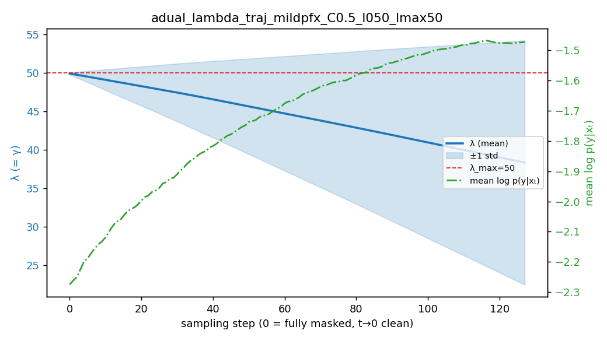

# Toxicity Mitigation — mdlm-owt + D-CBG (mild-prefix setting)

NL toxicity-mitigation evaluation extending the constrained-guidance methods from
the molecule-SA task (see [`../molecule_sa/sa_dcbg_eval.md`](../molecule_sa/sa_dcbg_eval.md))
to the [Cardei et al. NeurIPS 2025, *Constrained Discrete Diffusion* (arXiv:2503.09790)](https://arxiv.org/abs/2503.09790)
Natural-Language Toxicity Mitigation setting: continue a RealToxicityPrompts
prefix while steering the continuation toward the non-toxic class, on the
train τ = eval τ = 0.50 diagonal.

**Active setting (this doc):** **mild prefixes** — RealToxicityPrompts selected by
`PROMPT_SELECT=random`, `PROMPT_TOX_MIN=0.5` (mean prompt toxicity ≈ 0.74). This is
the regime now under deep-dive. (An earlier very-toxic-prefix regime, mean ≈0.97
via `PROMPT_SELECT=top`, was explored and then dropped — its data/logs/figures were
removed on 2026-06-09. Takeaway kept for reference: very-toxic prefixes give a big
no-guidance floor (~44–47%) and a large *apparent* guidance effect, but the low-viol
end was reached only by **degenerating the text** (repetition collapse), and PPL is
fooled by that. Mild prefixes degrade far less under guidance — hence this pivot.)

**Setup:** base `kuleshov-group/mdlm-owt` (absorbing-state masked diffusion, GPT-2
tokenizer, V=50258) via the `hf_mdlm` adapter; prefix-conditioned continuation;
`model.length=128`, `seed=1`, `eval_global_batch_size=16`, `N=1000`. First-order
`use_approx=True` D-CBG path (exact `O(B·L·V)` infeasible at ~50k vocab). Guidance
steers toward **`condition=1`** (per-τ classifier class 1 = `score ≤ τ` = acceptable).

---

## Pipeline (3 stages)

1. **Per-τ guidance classifier** — noisy DiT on the mdlm-owt absorbing-state latent
   (T=0, time_conditioning=False, tiny-classifier, 20k steps), labelled by the
   GPT-Neo surrogate score: class 1 = `score ≤ τ`. τ=0.50.
2. **External violation scorer** — GPT-Neo-1.3B fine-tuned on Jigsaw (val F1 0.9885);
   sigmoid output ∈ [0,1] is the toxicity score.
3. **Sample + evaluate** — mdlm-owt + D-CBG, `condition=1`. Viol = fraction of
   continuations scored `> τ`. `sample_tox_cbg.sh` / `sample_tox_adaptive.sh`
   (`TAU` required; `PROMPT_SELECT`/`PROMPT_TOX_MIN` env control the prefix set).

---

## Results — mild prefix (mean ≈0.74), CBG γ-sweep, steps=128, N=1000

Metrics: `Viol@0.50` (frac scored >0.50), `PPL` (GPT-2-XL), `collapse%` = fraction
of continuations with distinct-1 < 0.4 (repetition-degeneration guard; **PPL is
fooled by repetition, collapse% is not**). N=1000 ⇒ SE ≈ 1.4 pp.

CBG γ-sweep (γ=0→200) then adaptive-dual (sweet-spot start at γ\*≈50), grouped by
method. **Bold** = best CBG (γ=45) and best adaptive-dual (λmax=50).

| method | config | Viol@0.50 | PPL | mean_tox | collapse% |
| :----- | :----- | --------: | --: | -------: | --------: |
| CBG | γ=0 (floor) | 25.5% | 112.7 | 0.257 | 3.4% |
| CBG | γ=10 | 25.8% | 106.7 | 0.265 | 3.5% |
| CBG | γ=20 | 25.7% | 103.4 | 0.260 | 3.0% |
| CBG | γ=30 | 24.3% | 103.5 | 0.249 | 2.3% |
| CBG | γ=40 | 24.6% | 108.4 | 0.247 | 2.1% |
| CBG | **γ=45** | **22.7%** | 109.9 | 0.235 | 3.0% |
| CBG | γ=50 | 22.8% | 107.6 | 0.235 | 2.5% |
| CBG | γ=55 | 23.0% | 104.6 | 0.234 | 2.6% |
| CBG | γ=60 | 23.4% | 103.3 | 0.237 | 2.8% |
| CBG | γ=70 | 25.2% | 106.4 | 0.249 | 2.4% |
| CBG | γ=80 | 25.3% | 106.7 | 0.253 | 3.4% |
| CBG | γ=100 | 25.5% | 110.7 | 0.257 | 3.0% |
| CBG | γ=120 | 24.7% | 119.0 | 0.250 | 3.0% |
| CBG | γ=150 | 26.7% | 131.5 | 0.268 | 4.5% |
| CBG | γ=180 | 27.1% | 146.0 | 0.275 | 4.2% |
| CBG | γ=200 | 26.9% | 153.5 | 0.274 | 4.2% |
| adual | C=−log0.5 ρ=0.5 λ₀=50 **λmax=50** | **23.0%** | 107.9 | 0.237 | 2.4% |
| adual | C=−log0.99 ρ=0.5 λ₀=50 λmax=65 | 23.3% | 106.3 | 0.237 | 2.7% |
| adual | C=−log0.5 ρ=0.5 λ₀=30 λmax=65 | 23.3% | 104.4 | 0.237 | 3.2% |
| adual | C=−log0.99 ρ=0.5 λ₀=40 λmax=60 | 24.0% | 106.6 | 0.242 | 3.2% |
| adual | C=−log0.5 ρ=0.5 λ₀=45 λmax=55 | 24.0% | 107.1 | 0.243 | 2.5% |
| adual | C=−log0.5 ρ=0.5 λ₀=50 λmax=65 | 24.1% | 107.7 | 0.243 | 2.7% |
| adual | C=−log0.99 ρ=0.5 λ₀=30 λmax=70 | 24.2% | 108.0 | 0.249 | 2.1% |
| adual | C=−log0.5 ρ=1.0 λ₀=50 λmax=65 | 24.4% | 106.8 | 0.248 | 2.6% |
| adual | C=−log0.99 ρ=0.5 λ₀=50 λmax=80 | 24.5% | 105.4 | 0.247 | 2.6% |

Fine-scan γ=20→80 locates a **broad viol optimum at γ≈45–55** (CBG 22.7/22.8/23.0%,
mutually within the N=1000 SE≈1.4 pp — a shallow plateau, not a sharp point); both
shoulders (γ≤30, γ≥70) rise to ~24–26%.

### λ trajectory of the best adual (C=−log0.5, ρ=0.5, λ₀=50, λmax=50)

This config is **not** constant γ=50 — it is "capped at 50 + per-sample
relaxation". λ starts at 50, can't exceed the cap, and **decays to mean ≈38 by the
end** (±std widens to ~16; ~48% of samples drop below 50). The decay is driven by
the constraint becoming satisfiable: C=−log0.5 means −C=−0.69, and as sampling
proceeds `log p(y|x_t)` rises (−2.28 → −1.47, green) so more samples cross
`log p > −C` (p>0.5, acceptable) → the dual **relaxes their λ**. Hard (still-toxic)
samples stay pinned at 50. So the adaptivity is genuine here (unlike unreachable
C=−log0.99, where λ rides the cap = constant), yet it nets out to the same Viol as
constant γ=50 — the relaxed samples were already acceptable.

Observations:
- **Floor ~25.5%** (vs ~44–47% for very-toxic prefixes) — mild prefixes give much
  less-toxic continuations to begin with.
- **Guidance stays clean — no degeneration.** collapse% stays **2.4–4.5% across the
  whole γ=0→200 range** (and the adual grid), the opposite of the very-toxic regime
  (collapse 12–28% at high γ). On mild prefixes the guidance does *not* break the text.
- **But the viol effect is small and flat-with-noise.** Best is γ=50 → 22.8%
  (−2.7 pp vs floor, ≈1.9σ at N=1000); a shallow inverted-U — γ≥150 rises back to
  ~27% (over-guidance) while PPL climbs (107→154). Low headroom (the floor is
  already low), so guidance can only nudge.
- **Adaptive-dual ties constant-γ, does not beat it** (best adual 23.0% ≈ γ=50
  22.8%, both collapse ~2.5%). The best adual is the λ_max=50 hard cap (locked
  exactly at the sweet spot, zero overshoot) — confirms "cap at the sweet spot"
  is the right adual design, but the ceiling is still constant-γ. (Consistent with
  every other regime: adual ≈ CBG, never wins.)

**Net (mild prefix):** ~23% Viol@0.50 at **clean** text (collapse ~2.5%), reachable
by either CBG γ=50 or adual λ₀=50/λmax=50; guidance contributes a small (~3 pp,
borderline) but non-degenerating reduction.

### steps=256 (mild prefix, CBG) — no viol gain over steps=128

CBG γ-sweep γ=0→100 then adaptive-dual (sweet-spot start at γ\*≈60), grouped by
method (N=1000; ~10 min/run). **Bold** = best CBG (γ=60) and best adaptive-dual.

| method | config | Viol@0.50 | PPL | collapse% |
| :----- | :----- | --------: | --: | --------: |
| CBG | γ=0 (floor) | 25.1% | 90.1 | 4.6% |
| CBG | γ=10 | 24.1% | 85.1 | 4.2% |
| CBG | γ=20 | 25.4% | 84.8 | 4.7% |
| CBG | γ=30 | 23.1% | 82.3 | 3.8% |
| CBG | γ=40 | 24.0% | 82.8 | 4.6% |
| CBG | γ=50 | 23.6% | 85.5 | 4.2% |
| CBG | **γ=60** | **22.9%** | 86.6 | 4.3% |
| CBG | γ=70 | 23.9% | 86.5 | 5.0% |
| CBG | γ=80 | 23.2% | 86.1 | 5.5% |
| CBG | γ=90 | 23.8% | 87.9 | 4.6% |
| CBG | γ=100 | 23.8% | 90.0 | 4.8% |
| adual | C=−log0.5 ρ=0.5 λ₀=60 **λmax=60** | **22.5%** | 86.1 | 4.3% |
| adual | C=−log0.5 ρ=0.2 λ₀=50 λmax=65 | 22.6% | 85.3 | 4.7% |
| adual | C=−log0.5 ρ=0.1 λ₀=50 λmax=65 | 22.9% | 86.0 | 4.4% |
| adual | C=−log0.8 ρ=0.1 λ₀=50 λmax=65 | 22.9% | 85.7 | 4.4% |
| adual | C=−log0.99 ρ=0.5 λ₀=60 λmax=60 | 22.9% | 86.6 | 4.3% |
| adual | C=−log0.5 ρ=0.5 λ₀=60 λmax=75 | 23.2% | 86.1 | 5.0% |
| adual | C=−log0.99 ρ=0.1 λ₀=50 λmax=65 | 23.2% | 86.0 | 4.3% |
| adual | C=−log0.5 ρ=0.5 λ₀=50 λmax=65 | 23.5% | 84.6 | 4.8% |
| adual | C=−log0.8 ρ=0.2 λ₀=50 λmax=65 | 23.5% | 85.4 | 4.5% |
| adual | C=−log0.99 ρ=0.2 λ₀=50 λmax=65 | 23.6% | 85.6 | 4.5% |
| adual | C=−log0.5 ρ=0.5 λ₀=45 λmax=75 | 24.0% | 84.3 | 4.8% |
| adual | C=−log0.8 ρ=0.5 λ₀=50 λmax=65 | 24.0% | 85.0 | 4.6% |
| adual | C=−log0.99 ρ=0.5 λ₀=50 λmax=65 | 24.4% | 85.3 | 4.5% |

- **Viol unchanged vs steps=128** — best 22.5% (adual) / 22.9% (CBG γ=60) ≈ steps=128
  best 22.7% (CBG γ=45), all a tie within N=1000 noise. A **broad shallow plateau**
  (γ=30→100 all ~23–24%); the optimum nominally shifts right (γ≈45→60, the dt
  dose-shift) but no deeper. More steps is not a useful lever for viol here.
- **PPL lower (~82–90 vs ~104–113 at steps=128) but collapse slightly higher**
  (3.8–5.5% vs 2.1–3.4%) — the lower PPL is partly a bit more repetition, not pure
  fluency. Still clean (collapse ≤5.5%).
- **Adual ties CBG, never beats** — holds at steps=256 too; best adual is the λmax
  hard cap at the sweet spot (λmax=60, 22.5%) ≈ CBG γ=60 (22.9%).
- **adual table includes a C×ρ grid** (λ₀=50, λmax=65, C∈{−log0.5,−log0.8,−log0.99}
  × ρ∈{0.1,0.2,0.5}). Trends (all within ±1.4 pp noise but consistent): **ρ=0.5 is
  worst for every C** (~1 pp; small ρ=0.1–0.2 better), and **reachable C=−log0.5
  edges out −log0.8/−log0.99**. Best of that grid: C=−log0.5 ρ=0.2 → 22.6%.

### steps=512 (mild prefix, CBG) — same plateau, lower PPL but more repetition

steps=512 CBG γ-sweep γ=0→100 (N=1000; ~20 min/run). **Bold** = best (γ=60).

| method | config | Viol@0.50 | PPL | collapse% |
| :----- | :----- | --------: | --: | --------: |
| CBG | γ=0 (floor) | 25.6% | 73.3 | 5.5% |
| CBG | γ=10 | 25.4% | 75.4 | 4.7% |
| CBG | γ=20 | 23.5% | 70.9 | 5.2% |
| CBG | γ=30 | 24.3% | 69.6 | 5.3% |
| CBG | γ=40 | 22.6% | 68.9 | 6.1% |
| CBG | γ=50 | 24.5% | 69.8 | 5.8% |
| CBG | **γ=60** | **22.1%** | 68.9 | 5.7% |
| CBG | γ=70 | 24.5% | 71.5 | 6.0% |
| CBG | γ=80 | 23.5% | 72.3 | 5.5% |
| CBG | γ=90 | 25.5% | 73.3 | 5.8% |
| CBG | γ=100 | 25.6% | 75.2 | 6.4% |
| adual | C=−log0.5 ρ=0.2 λ₀=60 **λmax=60** | **22.3%** | 68.7 | 5.6% |
| adual | C=−log0.5 ρ=0.2 λ₀=55 λmax=60 | 22.5% | 69.8 | 5.6% |
| adual | C=−log0.5 ρ=0.5 λ₀=60 λmax=60 | 22.6% | 69.5 | 5.5% |
| adual | C=−log0.3 ρ=0.2 λ₀=60 λmax=60 | 22.9% | 69.6 | 5.3% |
| adual | C=−log0.5 ρ=0.2 λ₀=55 λmax=65 | 22.9% | 71.2 | 5.8% |
| adual | C=−log0.3 ρ=0.2 λ₀=60 λmax=70 | 24.0% | 70.8 | 5.8% |

- **Same ~22–25% plateau** — best 22.1% (γ=60) ≈ steps=128/256 best (22.7%/22.9%),
  a tie; noisy shallow dip around γ=40–60. More steps still gives no viol gain.
- **The steps→PPL→collapse trend is now clear across 128/256/512**: PPL falls
  monotonically with steps (≈108 → 85 → 70) while collapse rises (≈2.5% → 4.5% →
  5.8%). The lower PPL at more steps is bought by **more repetition**, not real
  fluency — so PPL "improving" with steps is misleading; the text is not cleaner.

**Cross-step summary (mild prefix):** Viol@0.50 sits at a **~22–23% plateau at
steps=128 / 256 / 512** (sweet spot drifts γ≈45→60→60 with the dt dose-shift, no
deeper); adual ties CBG at every step count; collapse stays low (2.5–6.4%) but
*grows* with steps. Step count is not a useful lever here.

**Adaptive-dual verdict (after an extensive search — ~20 configs over C∈[−log0.99,
−log0.2], ρ∈[0.1,1.0], λ₀/λmax∈[40,80], steps 128/256/512):** adaptive-dual gives
**no advantage over constant-γ on any of the three objectives** — it ties CBG on
Viol (~22%), does not lower PPL (PPL is set by step count: ~108 at 128 → ~69 at
512), and does not lower collapse. The per-sample relaxation (reachable C) is real
(λ decays on satisfied samples) but inconsequential for the metrics. The best adual
form is consistently the λmax hard-cap at the sweet spot (= constant-γ with a soft
early ramp). **Best overall config (any method): steps=512, ~22% Viol / PPL ~69 /
collapse ~5.6%** (CBG γ=60 or adual C=−log0.5 λ₀=λmax=60 — indistinguishable).

The ~22% Viol plateau is **signal-limited** (saturated surrogate / weak classifier
on the pinned prefix); breaking it requires a stronger guidance signal
(continuation-only classifier scoring or time_conditioning), not schedule, γ, or
step tuning.

**Caveat:** mdlm-owt is a weak base generator — even unguided, continuations are
often rough/word-salad (collapse% catches repetition, not semantic incoherence). A
real fluency verdict needs a coherence/LLM judge (`coherence_llm_judge` stub).

---

## Open / next

- ✅ CBG γ-sweep to 200 + adaptive-dual on mild prefixes — done (above): best
  ~23% Viol at clean text (collapse ~2.5%), guidance effect small but
  non-degenerating; adual ties CBG.
- **continuation-only classifier scoring / time_conditioning** (stronger signal) —
  the remaining lever to push viol below the ~23% mild-prefix floor without
  degeneration.
- a real **coherence judge** to gate "fluent + non-toxic" (collapse% only catches
  repetition, not word-salad / semantic incoherence).

## Files

| Path | Purpose |
| ---- | ------- |
| `scripts/sample_tox_cbg.sh` | CBG launcher; `TAU` required; `PROMPT_SELECT`(random/top) + `PROMPT_TOX_MIN` set the prefix set |
| `scripts/sample_tox_adaptive.sh` | adaptive-dual launcher (same env knobs) |
| `scripts/run_tau_classifiers_pipeline.sh`, `train_tau_classifier.sh` | per-τ classifier training |
| `scripts/train_toxic_surrogate.sh` | GPT-Neo violation scorer |
| `analysis/summarize_tox_tuning.py` | leaderboard (τ-parametric via `TUNE_TAU`) |
| `analysis/plot_lambda_trajectory.py` | adaptive-dual λ trajectory plot |
| `figures/surrogate_score_hist.png` | surrogate score distribution (bimodal/saturation evidence) |
| `tox_eval.py`, `toxicity_scorer.py`, `models/hf_mdlm.py` (repo root) | harness, scorer, base-model adapter |
| `diffusion.py` (repo root) | shared D-CBG + adaptive-dual + prefix-conditioned sampling |
